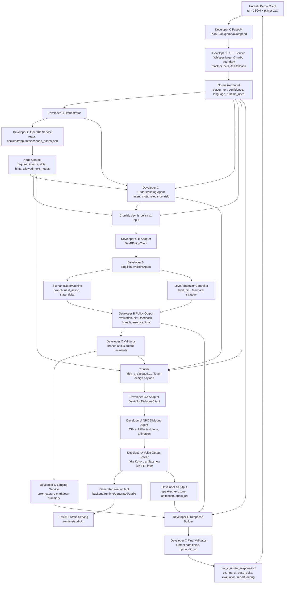

# Murphy AI Architecture

담당자: Sean Han, 용희 김, William Kim
상태: 완료
시작일: 06/04/2026
마감일: 06/04/2026
우선순위: 높음
작업 유형: Architecture
마감기한: 프프로토
요약:   • 전체 아키텍쳐 mermaid

**2. 전체 AI 구조 Mermaid**

핵심은 C가 orchestration/validation/response assembly를 잡고, B는 policy, A는 dialogue/voice만 담당한다는 구조입니다.