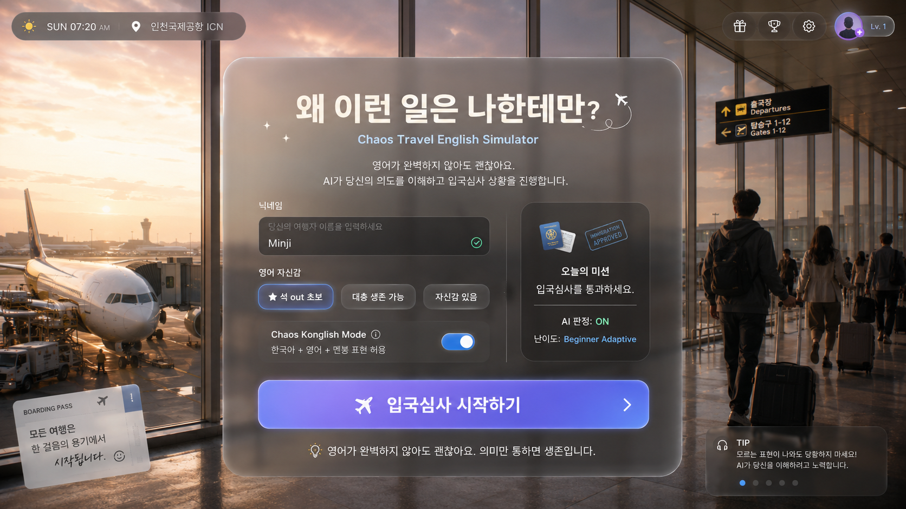

# Prototype

2026년 5월 27일 

# Ver. 0

## Chapter 0: Immigration Check

#### 부제: “첫 관문부터 석 out”

| 기능 | 설명 |
| --- | --- |
| 로그인 | 플레이어 이름/레벨/세션 생성 |
| 시나리오 노드 진행 | 입국심사 질문 순서대로 진행 |
| AI 발화 이해 | 콩글리쉬/한국어 섞인 답변을 의도로 해석 |
| 분기 처리 | 성공/힌트/재질문/실패 분기 |
| 피드백 제공 | 더 자연스러운 영어 표현 추천 |

## 1. 전체 플레이 플로우

```markdown
[로그인 화면]
    ↓
[메인 진입 / Start Prototype]
    ↓
[공항 입국심사장 로딩]
    ↓
[입국심사관 NPC 앞에 서기]
    ↓
[질문 1: 방문 목적]
    ↓
[AI 발화 판정]
    ↓
[질문 2: 체류 기간]
    ↓
[AI 발화 판정]
    ↓
[질문 3: 숙소 위치]
    ↓
[AI 발화 판정]
    ↓
[질문 4: 귀국 항공권 여부]
    ↓
[최종 판정]
    ↓
[입국 통과 / 추가 질문 / 실패]
    ↓
[결과 리포트]
```

## 2. 입국심사 시나리오 개요

### 배경

플레이어는 미국 공항에 도착했다.

비행기를 막 내리고 입국심사 줄을 통과한 뒤, 심사관 앞에 선다.

심사관은 차갑고 공식적인 태도로 질문한다.

플레이어는 영어로 답해야 하지만, 한국어와 콩글리쉬를 섞어도 된다.

### 주요 NPC

### Immigration Officer

| 항목 | 설정 |
| --- | --- |
| 이름 | Officer Miller |
| 역할 | 입국심사관 |
| 말투 | 짧고 공식적 |
| 성격 | 무뚝뚝하지만 불친절하진 않음 |
| 목표 | 방문 목적, 체류 기간, 숙소, 귀국 계획 확인 |
| 난이도 | 플레이어 레벨에 따라 질문 길이 조절 |

## Node 1. 입국심사 시작

### Node ID

```
IMM_001_START
```

### 화면 연출

```
공항 입국심사장.
플레이어는 줄을 지나 심사관 부스 앞에 선다.
심사관이 여권을 바라본 뒤 고개를 든다.
```

### NPC 대사

```
Next. Passport, please.
```

### 플레이어 목표

```
여권을 제출한다.
```

### 플레이어 입력 예시

```
Here you go.
```

```
Passport 여기요.
```

```
Here is my passport.
```

### 성공 조건

`passport_submit` 의도가 감지되면 성공.

### 다음 노드

```
IMM_002_PURPOSE
```

---

## Node 2. 방문 목적 질문

### Node ID

```
IMM_002_PURPOSE
```

### NPC 대사

```
What is the purpose of your visit?
```

### 한국어 UI 힌트

```
미국에 온 목적을 말해보세요.
예: 여행, 관광, 친구 방문
```

### 플레이어 목표

방문 목적을 설명한다.

---

## 허용 답변 예시

### 정상 영어

```
I'm here for travel.
```

```
I'm visiting for sightseeing.
```

```
I'm here on vacation.
```

### Beginner Konglish

```
Travel이요.
```

```
Sightseeing 하러 왔어요.
```

```
Vacation이에요.
```

```
친구 만나러 왔어요. Visit friend.
```

### Chaos Konglish

```
Travel이요. Trouble 아니에요. 진짜 clean human입니다.
```

```
Tourist입니다. Final boss처럼 보지 말아주세요.
```

```
Purpose는 happy travel인데 현재 mental은 not happy.
```

```
먹고 보고 사진 찍고 돈 쓰러 왔어요. Harmless Korean입니다.
```

---

## AI 판정

### 성공 Intent

```
visit_purpose_travel
visit_purpose_sightseeing
visit_purpose_vacation
visit_purpose_visit_friend
visit_purpose_business
```

### 실패 또는 재질문

아래처럼 목적이 불명확하면 재질문.

```
I don't know.
```

```
America.
```

```
Yes.
```

```
석 out 났어요.
```

### NPC 재질문

```
Are you here for travel, business, or something else?
```

### 성공 시 다음 노드

```
IMM_003_DURATION
```

---

## Node 3. 체류 기간 질문

### Node ID

```
IMM_003_DURATION
```

### NPC 대사

```
How long will you stay?
```

### 한국어 UI 힌트

```
얼마나 머무를 예정인지 말해보세요.
예: 5일, 일주일, 다음 주 월요일까지
```

### 플레이어 목표

체류 기간을 말한다.

---

## 허용 답변 예시

### 정상 영어

```
I will stay for five days.
```

```
I'm staying for one week.
```

```
Until next Monday.
```

### Beginner Konglish

```
Five days요.
```

```
I stay five days.
```

```
One week이에요.
```

```
다음 Monday까지요.
```

### Chaos Konglish

```
Five days요. Long stay 아니고 short human입니다.
```

```
One week인데 마음은 already home각이에요.
```

```
Until Monday요. Monday is 탈출 day.
```

```
Seven days. Forever 아니에요. Promise합니다.
```

---

## AI 판정

### 추출해야 할 Slot

```
{
  "stay_duration":"5 days"
}
```

또는

```
{
  "stay_until":"next Monday"
}
```

### 성공 조건

체류 기간 또는 종료일이 감지되면 성공.

### 실패 재질문

```
How many days will you stay?
```

### 다음 노드

```
IMM_004_STAY_LOCATION
```

---

## Node 4. 숙소 질문

### Node ID

```
IMM_004_STAY_LOCATION
```

### NPC 대사

```
Where are you staying?
```

### 한국어 UI 힌트

```
어디에서 머무를 예정인지 말해보세요.
예: 호텔, 친구 집, 예약한 숙소
```

### 플레이어 목표

숙소 정보를 말한다.

---

## 허용 답변 예시

### 정상 영어

```
I'm staying at a hotel in LA.
```

```
I'm staying at the Sunset Hotel.
```

```
I'll stay at my friend's house.
```

### Beginner Konglish

```
Hotel이에요.
```

```
I stay hotel in LA.
```

```
This address요.
```

```
친구 집이요. Friend house.
```

### Chaos Konglish

```
Hotel이요. I have address. Phone이 배신 안 하면 보여드릴게요.
```

```
This hotel이에요. 이름은... memory loading 중입니다.
```

```
Friend house요. Real friend입니다. 카톡 friend.
```

```
Here address. 발음은 모르지만 location exists.
```

---

## AI 판정

### 추출해야 할 Slot

```
{
  "stay_location_type":"hotel",
  "stay_location_name":"Sunset Hotel",
  "stay_city":"LA"
}
```

### 성공 조건

아래 중 하나라도 명확하면 성공.

```
호텔
친구 집
숙소 주소
숙소 이름
도시
```

### 실패 재질문

```
Do you have a hotel address?
```

### 다음 노드

```
IMM_005_RETURN_TICKET
```

---

## Node 5. 귀국 항공권 질문

### Node ID

```
IMM_005_RETURN_TICKET
```

### NPC 대사

```
Do you have a return ticket?
```

### 한국어 UI 힌트

```
돌아가는 비행기표가 있는지 말해보세요.
```

### 플레이어 목표

귀국 항공권이 있음을 말한다.

---

## 허용 답변 예시

### 정상 영어

```
Yes, I have a return ticket.
```

```
Yes, my flight is next Monday.
```

```
Here is my return ticket.
```

### Beginner Konglish

```
Yes, return ticket 있어요.
```

```
다음 Monday flight 있어요.
```

```
Here ticket요.
```

```
Korea back ticket 있어요.
```

### Chaos Konglish

```
Yes, return ticket 있어요. 저도 집에는 가야죠.
```

```
Next Monday flight입니다. Escape plan exists.
```

```
Here ticket요. 제 귀국 희망입니다.
```

```
Korea back ticket 있어요. Home각 already prepared.
```

---

## AI 판정

### 성공 Intent

```
has_return_ticket
```

### 추출 Slot

```
{
  "return_ticket":true,
  "return_date":"next Monday"
}
```

### 실패 재질문

```
When is your flight back?
```

### 다음 노드

```
IMM_006_FINAL_DECISION
```

---

# 8. 최종 판정 노드

## Node ID

```
IMM_006_FINAL_DECISION
```

AI는 지금까지의 슬롯을 확인해.

```
{
  "passport_submitted":true,
  "visit_purpose":"travel",
  "stay_duration":"5 days",
  "stay_location":"hotel in LA",
  "return_ticket":true
}
```

---

## 성공 엔딩

### 조건

필수 정보가 모두 채워짐.

```
방문 목적 O
체류 기간 O
숙소 O
귀국 항공권 O
```

### NPC 대사

```
Okay. Enjoy your stay.
```

### UI 메시지

```
입국심사 통과!
혼돈 속에서도 의미 전달에 성공했습니다.
```

### 다음 화면

```
Result Report
```

---

## 부분 성공 엔딩

### 조건

핵심 정보는 전달됐지만 일부 답변이 애매함.

예:

```
방문 목적 O
체류 기간 O
숙소 애매함
귀국 항공권 O
```

### NPC 대사

```
Next time, please prepare your hotel address. You may go.
```

### UI 메시지

```
입국심사 통과!
하지만 숙소 정보가 조금 부족했습니다.
```

---

## 추가 질문 엔딩

### 조건

정보가 부족하거나 발화가 계속 불명확함.

### NPC 대사

```
I need to ask you a few more questions.
```

### UI 메시지

```
추가 질문 발생!
더 명확하게 답변해야 합니다.
```

### 다음 노드 예시

```
IMM_EXTRA_001_CLARIFY_PURPOSE
```

---

## 실패 엔딩

프로토타입에서는 완전 실패를 너무 세게 만들 필요는 없어.

대신 “재도전”으로 처리하는 게 좋아.

### NPC 대사

```
Please step aside for a moment.
```

### UI 메시지

```
입국심사 실패
의도가 충분히 전달되지 않았습니다.
다시 시도해보세요.
```

---

# 9. 결과 리포트 화면

입국심사가 끝나면 학습 피드백을 보여줘.

## 화면 구성

```
┌──────────────────────────────────────────────┐
│              입국심사 결과                    │
│                                              │
│  결과: 통과                                  │
│  영어 레벨: Beginner                         │
│  의미 전달 점수: 82                          │
│  문법 점수: 41                               │
│  콩글리쉬 생존력: 95                         │
│                                              │
│  가장 잘한 표현                              │
│  “Travel이요. Trouble 아니에요.”              │
│                                              │
│  추천 표현                                   │
│  “I'm here for travel.”                      │
│  “I will stay for five days.”                │
│  “I'm staying at a hotel in LA.”             │
│                                              │
│  [다시 하기] [공항으로 나가기]                │
└──────────────────────────────────────────────┘
```

---

# 10. 시나리오 그래프 요약

```
LOGIN
  ↓
IMM_001_START
  ↓
IMM_002_PURPOSE
  ├── success → IMM_003_DURATION
  ├── unclear → IMM_002_HINT
  └── fail x2 → IMM_EXTRA_001
  ↓
IMM_003_DURATION
  ├── success → IMM_004_STAY_LOCATION
  ├── unclear → IMM_003_HINT
  └── fail x2 → IMM_EXTRA_002
  ↓
IMM_004_STAY_LOCATION
  ├── success → IMM_005_RETURN_TICKET
  ├── unclear → IMM_004_HINT
  └── fail x2 → IMM_EXTRA_003
  ↓
IMM_005_RETURN_TICKET
  ├── success → IMM_006_FINAL_DECISION
  ├── unclear → IMM_005_HINT
  └── fail x2 → IMM_EXTRA_004
  ↓
IMM_006_FINAL_DECISION
  ├── pass → RESULT_PASS
  ├── partial_pass → RESULT_PARTIAL
  └── fail → RESULT_RETRY
```

---

# 11. 프로토타입용 시나리오 JSON 예시

아래 구조를 백엔드 시나리오 데이터로 쓰면 좋아.

```
{
  "chapter_id":"CHAPTER_00_IMMIGRATION",
  "title":"Immigration Check",
  "start_node_id":"IMM_001_START",
  "nodes": [
    {
      "node_id":"IMM_001_START",
      "scene_id":"AIRPORT_IMMIGRATION",
      "npc_id":"OFFICER_MILLER",
      "objective_kr":"여권을 제출하세요.",
      "npc_line":"Next. Passport, please.",
      "required_intents": ["passport_submit"],
      "allowed_next_nodes": ["IMM_002_PURPOSE","IMM_001_HINT"],
      "hint_kr":"여권을 건네는 표현을 말해보세요. 예: Here you go.",
      "success_feedback_kr":"좋아요. 여권 제출 의도가 전달됐습니다."
    },
    {
      "node_id":"IMM_002_PURPOSE",
      "scene_id":"AIRPORT_IMMIGRATION",
      "npc_id":"OFFICER_MILLER",
      "objective_kr":"방문 목적을 말하세요.",
      "npc_line":"What is the purpose of your visit?",
      "required_intents": [
"visit_purpose_travel",
"visit_purpose_sightseeing",
"visit_purpose_vacation",
"visit_purpose_visit_friend",
"visit_purpose_business"
      ],
      "required_slots": ["visit_purpose"],
      "allowed_next_nodes": [
"IMM_003_DURATION",
"IMM_002_HINT",
"IMM_EXTRA_001_CLARIFY_PURPOSE"
      ],
      "hint_kr":"여행이면 'I'm here for travel.' 또는 'Travel이요.'라고 말할 수 있어요.",
      "success_feedback_kr":"방문 목적 전달 성공!",
      "better_expressions": [
"I'm here for travel.",
"I'm visiting for sightseeing.",
"I'm here on vacation."
      ]
    },
    {
      "node_id":"IMM_003_DURATION",
      "scene_id":"AIRPORT_IMMIGRATION",
      "npc_id":"OFFICER_MILLER",
      "objective_kr":"체류 기간을 말하세요.",
      "npc_line":"How long will you stay?",
      "required_intents": ["state_stay_duration"],
      "required_slots": ["stay_duration"],
      "allowed_next_nodes": [
"IMM_004_STAY_LOCATION",
"IMM_003_HINT",
"IMM_EXTRA_002_CLARIFY_DURATION"
      ],
      "hint_kr":"며칠 머무를지 말해보세요. 예: Five days요.",
      "success_feedback_kr":"체류 기간 전달 성공!",
      "better_expressions": [
"I will stay for five days.",
"I'm staying for one week.",
"Until next Monday."
      ]
    },
    {
      "node_id":"IMM_004_STAY_LOCATION",
      "scene_id":"AIRPORT_IMMIGRATION",
      "npc_id":"OFFICER_MILLER",
      "objective_kr":"숙소 위치를 말하세요.",
      "npc_line":"Where are you staying?",
      "required_intents": ["state_stay_location"],
      "required_slots": ["stay_location"],
      "allowed_next_nodes": [
"IMM_005_RETURN_TICKET",
"IMM_004_HINT",
"IMM_EXTRA_003_CLARIFY_STAY"
      ],
      "hint_kr":"호텔이나 친구 집처럼 머무는 곳을 말해보세요.",
      "success_feedback_kr":"숙소 정보 전달 성공!",
      "better_expressions": [
"I'm staying at a hotel in LA.",
"I'm staying at the Sunset Hotel.",
"I'm staying at my friend's house."
      ]
    },
    {
      "node_id":"IMM_005_RETURN_TICKET",
      "scene_id":"AIRPORT_IMMIGRATION",
      "npc_id":"OFFICER_MILLER",
      "objective_kr":"귀국 항공권이 있는지 말하세요.",
      "npc_line":"Do you have a return ticket?",
      "required_intents": ["has_return_ticket"],
      "required_slots": ["return_ticket"],
      "allowed_next_nodes": [
"IMM_006_FINAL_DECISION",
"IMM_005_HINT",
"IMM_EXTRA_004_CLARIFY_RETURN"
      ],
      "hint_kr":"돌아가는 항공권이 있으면 'Yes, I have a return ticket.'라고 말할 수 있어요.",
      "success_feedback_kr":"귀국 계획 전달 성공!",
      "better_expressions": [
"Yes, I have a return ticket.",
"My return flight is next Monday.",
"Here is my return ticket."
      ]
    }
  ]
}
```

---

# 12. AI 응답 예시

플레이어가 이렇게 말했을 때:

```
Travel이요. Trouble 아니에요. 진짜 clean human입니다.
```

AI 백엔드는 이렇게 응답하면 좋아.

```
{
  "turn_id":"turn_002",
  "status":"success",
  "understanding": {
    "intent":"visit_purpose_travel",
    "intent_success":true,
    "meaning_summary_kr":"플레이어는 여행 목적으로 방문했다고 말함.",
    "emotion":"nervous_humor",
    "konglish_detected":true
  },
  "assessment": {
    "english_level_signal":"beginner",
    "intent_score":0.92,
    "grammar_score":0.38,
    "chaos_konglish_score":0.88
  },
  "npc_response": {
    "speaker":"Officer Miller",
    "text":"Travel. Okay. How long will you stay?",
    "tone":"formal_neutral",
    "animation":"officer_check_passport"
  },
  "feedback": {
    "message_kr":"의미 전달 성공! 표현은 혼돈이지만 목적은 명확했습니다.",
    "better_expression":"I'm here for travel."
  },
  "branch": {
    "next_node_id":"IMM_003_DURATION"
  },
  "commands": [
    {
      "type":"SHOW_SUBTITLE",
      "speaker":"Officer Miller",
      "text":"Travel. Okay. How long will you stay?"
    },
    {
      "type":"SHOW_FEEDBACK",
      "text":"의미 전달 성공! Better: I'm here for travel."
    },
    {
      "type":"LOAD_NODE",
      "node_id":"IMM_003_DURATION"
    }
  ]
}
```

---

# 13. 구현 우선순위

프로토타입이면 아래 순서로 만들면 돼.

## 1순위

```
로그인 화면
세션 시작
입국심사장 맵 진입
NPC 질문 출력
플레이어 텍스트 입력
AI 백엔드 호출
commands 실행
다음 노드 이동
결과 화면 출력
```

## 2순위

```
음성 입력 STT
NPC 애니메이션
플레이어 표정/긴장도 UI
Chaos Konglish 점수
힌트 버튼
다시 말하기 버튼
```

## 3순위

```
TTS 음성 출력
입국심사 줄 연출
카메라 컷신
여권 제출 애니메이션
심사관 감정 변화
로그 기반 학습 리포트
```

---

# 14. 로그인 화면 디자인 방향

## 추천 스타일

기존에 만든 게임플레이 이미지 톤과 맞추려면 로그인 화면도 **고급스러운 여행 시뮬레이션 UI**로 가면 좋아.

### 분위기

```
공항 유리창 배경
저녁 또는 아침 빛
캐리어 실루엣
항공권 느낌의 카드 UI
깔끔한 반투명 패널
살짝 코믹한 문구
```

---

## 로그인 화면 구성안

```
배경:
공항 터미널 또는 활주로가 보이는 대형 창문

중앙 카드:
- 게임 제목
- 닉네임 입력
- 영어 자신감 선택
- Chaos Konglish Mode 토글
- Start 버튼

오른쪽 작은 안내:
- 오늘의 미션: 입국심사 통과하기
- 난이도: Beginner Adaptive
- AI 판정: ON

하단:
- “영어가 틀려도 괜찮아요. 입국만 하면 됩니다.”
```

---

# 15. 로그인 화면 UI 텍스트 최종안

```
왜 이런 일은 나한테만?
Chaos Travel English Simulator
```

```
닉네임
당신의 여행자 이름을 입력하세요.
```

```
영어 자신감
[ 석 out 초보 ] [ 대충 생존 가능 ] [ 자신감 있음 ]
```

```
Chaos Konglish Mode
한국어 + 영어 + 멘붕 표현 허용
```

```
오늘의 미션
입국심사를 통과하세요.
```

```
입국심사 시작하기
```

```
영어가 완벽하지 않아도 괜찮아요.
의미만 통하면 생존입니다.
```

# Ver. 1

# 입국심사 프로토타입 대화 시나리오




## 0. 시작 상황

**상황**

플레이어가 입국심사관 앞에 선다.

**NPC**

Next. Passport, please.

**플레이어 답변 예시**

- Here you go.
- Here is my passport.
- Passport 여기요.
- 여권 여기 있습니다.

**AI 판정**

- 의도: passport_submit
- 성공 시 다음 질문으로 이동

---

## 1. 방문 목적 질문

**NPC 질문**

What is the purpose of your visit?

**한국어 힌트**

미국에 온 목적을 말해보세요.

예: 여행, 관광, 친구 방문

**플레이어 답변 예시**

- I'm here for travel.
- I'm here on vacation.
- Travel이요.
- Sightseeing 하러 왔어요.
- 친구 만나러 왔어요. Visit friend.
- Travel이요. Trouble 아니에요. 진짜 clean human입니다.
- Tourist입니다. Final boss처럼 보지 말아주세요.
- 먹고 보고 사진 찍고 돈 쓰러 왔어요. Harmless Korean입니다.

**AI 판정**

- 인식 의도: visit_purpose_travel / visit_purpose_vacation / visit_purpose_visit_friend
- 추출 슬롯: visit_purpose
- 성공 조건: 방문 목적이 명확하면 통과
- 실패 시 재질문: Are you here for travel, business, or something else?

**추천 표현**

I'm here for travel.

---

## 2. 체류 기간 질문

**NPC 질문**

How long will you stay?

**한국어 힌트**

얼마나 머무를 예정인지 말해보세요.

예: 5일, 일주일, 다음 주 월요일까지

**플레이어 답변 예시**

- I will stay for five days.
- I'm staying for one week.
- Until next Monday.
- Five days요.
- I stay five days.
- One week이에요.
- 다음 Monday까지요.
- Five days요. Long stay 아니고 short human입니다.
- One week인데 마음은 already home각이에요.
- Until Monday요. Monday is 탈출 day.

**AI 판정**

- 인식 의도: state_stay_duration
- 추출 슬롯: stay_duration 또는 stay_until
- 성공 조건: 체류 기간 또는 종료일이 있으면 통과
- 실패 시 재질문: How many days will you stay?

**추천 표현**

I will stay for five days.

---

## 3. 숙소 위치 질문

**NPC 질문**

Where are you staying?

**한국어 힌트**

어디에서 머무를 예정인지 말해보세요.

예: 호텔, 친구 집, 예약한 숙소

**플레이어 답변 예시**

- I'm staying at a hotel in LA.
- I'm staying at the Sunset Hotel.
- I'll stay at my friend's house.
- Hotel이에요.
- I stay hotel in LA.
- This address요.
- 친구 집이요. Friend house.
- Hotel이요. I have address. Phone이 배신 안 하면 보여드릴게요.
- This hotel이에요. 이름은... memory loading 중입니다.
- Friend house요. Real friend입니다. 카톡 friend.
- Here address. 발음은 모르지만 location exists.

**AI 판정**

- 인식 의도: state_stay_location
- 추출 슬롯: stay_location / stay_location_type / stay_city
- 성공 조건: 호텔, 친구 집, 주소, 숙소 이름, 도시 중 하나 이상이 감지되면 통과
- 실패 시 재질문: Do you have a hotel address?

**추천 표현**

I'm staying at a hotel in LA.

---

## 4. 귀국 항공권 질문

**NPC 질문**

Do you have a return ticket?

**한국어 힌트**

돌아가는 비행기표가 있는지 말해보세요.

**플레이어 답변 예시**

- Yes, I have a return ticket.
- Yes, my flight is next Monday.
- Here is my return ticket.
- Yes, return ticket 있어요.
- 다음 Monday flight 있어요.
- Here ticket요.
- Korea back ticket 있어요.
- Yes, return ticket 있어요. 저도 집에는 가야죠.
- Next Monday flight입니다. Escape plan exists.
- Here ticket요. 제 귀국 희망입니다.
- Korea back ticket 있어요. Home각 already prepared.

**AI 판정**

- 인식 의도: has_return_ticket
- 추출 슬롯: return_ticket / return_date
- 성공 조건: 귀국 항공권 또는 귀국 날짜가 감지되면 통과
- 실패 시 재질문: When is your flight back?

**추천 표현**

Yes, I have a return ticket.

---

## 5. 최종 통과 대사

**조건**

방문 목적, 체류 기간, 숙소, 귀국 항공권 정보가 모두 전달됨.

**NPC 대사**

Okay. Enjoy your stay.

**결과 메시지**

입국심사 통과!

영어는 흔들렸지만 의미 전달에는 성공했습니다.

---

## 6. 추가 질문 분기

**조건**

답변이 애매하거나 정보가 부족함.

**NPC 대사**

I need to ask you a few more questions.

**UI 메시지**

추가 질문 발생!

더 명확하게 답변해야 합니다.

**추가 질문 예시**

- Are you traveling alone?
- Do you have a hotel address?
- When is your flight back?
- Can you show me your booking confirmation?

---

## 7. 재도전 분기

**조건**

의도 전달 실패가 반복됨.

**NPC 대사**

Please step aside for a moment.

**UI 메시지**

입국심사 실패.

의도가 충분히 전달되지 않았습니다. 다시 시도해보세요.

---

## 8. 결과창 점수 시스템

**평가 항목**

- 의미 전달: 질문에 맞는 의도를 전달했는가
- 문법: 문장 구조가 자연스러운가
- 자신감: 답변이 명확한가
- 생존력: 콩글리쉬라도 상황 해결에 성공했는가

**예시 점수**

- 의미 전달: 92
- 문법: 68
- 자신감: 74
- 생존력: 95
- 총점: 82

**티어 기준**

- 브론즈: 0 - 59
- 실버: 60 - 84
- 골드: 85 - 100

**결과 예시**

획득 티어: 실버

**Best Expression**

Travel이요. Trouble 아니에요.

**추천 표현**

I'm here for travel.


