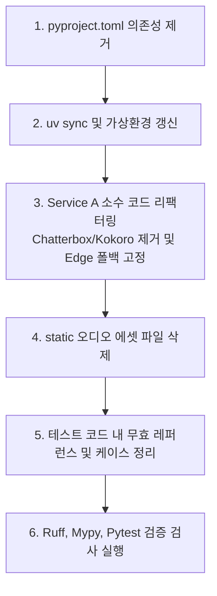

# TTS 엔진 슬리밍 및 불필요 자원 정리 작업계획서 (Developer A)

이 문서는 개발자 A(Developer A) 소유 범위 내에서 사용하지 않는 음성 합성(TTS) 엔진인 **Chatterbox TTS** 및 **Kokoro TTS**와 관련된 모든 코드, 테스트 케이스, 환경 변수 및 라이브러리 의존성을 제거하고, 기본/폴백(Fallback) 음성 엔진을 **Edge TTS**로 단일화하기 위한 리팩터링 및 정리 작업 계획서입니다.

---

## 1. 정리 및 리팩터링 목표 (Goals)

- **경량화 (Slimming):** 로컬 딥러닝 기반 음성 합성 엔진인 Chatterbox(180MB 이상) 및 Kokoro 관련 패키지와 무거운 머신러닝 라이브러리인 PyTorch(`torch`, `torchaudio`) 의존성을 제거하여 가상환경 크기와 설치 시간을 획기적으로 단축합니다.
- **단순화 (Simplification):** ElevenLabs의 실시간 API 호출 실패 시, 유일한 로컬 백업(Fallback) 엔진으로 Edge TTS만 남겨두고 복잡한 감정 제어 및 속도 매핑 분기 코드를 정리합니다.
- **안정성 유지 (Stability):** 리팩터링 이후에도 `pytest`, `ruff`, `mypy` 검사를 모두 100% 통과하도록 테스트 모크(Mock) 코드를 함께 갱신합니다.

---

## 2. 삭제 및 정리 대상 목록 (Cleanup Targets)

### ① 라이브러리 의존성 및 설정 파일 정리
- **[pyproject.toml](file:///C:/5th_project/pj05_Murphy/pyproject.toml):** 
  - `dependencies` 목록에서 `chatterbox-tts==0.1.7`, `kokoro>=0.9.4`, `espeakng-loader>=0.2.4`, `torch==2.6.0` 제거.
  - `tool.uv.sources` 및 PyTorch CUDA 전용 인덱스(`pytorch-cu124`) 설정 블록 삭제.
- **[.env.example](file:///C:/5th_project/pj05_Murphy/.env.example) 및 `.env`:**
  - `MURPHY_CHATTERBOX_*` 환경 변수(Voice ID, Ref Audio 경로, Exaggeration, CFG Weight 등) 삭제.
  - `MURPHY_TTS_PROVIDER` 기본값을 `edge`로 변경.

### ② 소스 코드 리팩터링 (Developer A 소유 범위)
- **[tts_provider_service.py](file:///C:/5th_project/pj05_Murphy/backend/app/services/service_a/tts_provider_service.py):**
  - `ChatterboxTTSProvider` 클래스 및 관련 내부 헬퍼(`_load_chatterbox_model`, `_resolve_chatterbox_device`) 완전 삭제.
  - `KokoroTTSProvider` 클래스 및 의존성 동적 로드 로직 완전 삭제.
- **[tts_service.py](file:///C:/5th_project/pj05_Murphy/backend/app/services/service_a/tts_service.py):**
  - `build_chatterbox_provider_request` 및 `build_kokoro_provider_request` 제거.
  - Kokoro 전용 속도 제어 헬퍼 함수 `_kokoro_speed` 제거.
- **[voice_output_service.py](file:///C:/5th_project/pj05_Murphy/backend/app/services/service_a/voice_output_service.py):**
  - `_build_kokoro_audio` 함수 및 `chatterbox` 관련 분기 코드 삭제.
  - `chatterbox` 관련 튜닝 파라미터 매핑 함수 `_chatterbox_exaggeration_for_tone`, `_chatterbox_cfg_weight_for_tone` 제거.
  - `_resolve_provider` 함수에서 허용하는 프로바이더 목록에서 `kokoro`, `chatterbox` 제외 및 기본값 리턴을 `edge`로 수정.
- **[npc_roster_service.py](file:///C:/5th_project/pj05_Murphy/backend/app/services/service_a/npc_roster_service.py):**
  - `NPCProfile` 구조체 내의 `kokoro_voices` 필드 제거 및 각 캐릭터 프로필 데이터에서 해당 튜플 삭제. (필요 시 edge용 voice id를 매핑하는 형태로 간소화)
- **[voice_profile_service.py](file:///C:/5th_project/pj05_Murphy/backend/app/services/service_a/voice_profile_service.py):**
  - `npc_profile.kokoro_voices`를 조회하여 보이스 ID를 선택하는 로직을 Edge TTS 보이스 목록 기반 조회로 대체 혹은 제거.

### ③ 정적 리소스 파일 삭제
- **`backend/app/assets/voices/officer_miller_ref.wav`:**
  - Chatterbox 음성 복제(Voice Cloning)용으로 기재되어 있던 참조 오디오 샘플 파일 삭제.

### ④ 테스트 코드 파일 정리
- **[test_developer_a_agent_run_logging.py](file:///C:/5th_project/pj05_Murphy/backend/tests/test_developer_a_agent_run_logging.py):**
  - `chatterbox` 프로바이더 스위칭 및 mock 테스트 케이스(`test_voice_output_can_switch_to_chatterbox_tts_provider_with_emotion_parameters`, `test_chatterbox_provider_does_not_pass_language_id_to_base_generate` 등) 제거.
- **[test_developer_a_npc_emotion_escalation.py](file:///C:/5th_project/pj05_Murphy/backend/tests/test_developer_a_npc_emotion_escalation.py):**
  - Kokoro 기반의 속도 하강 검증 테스트(`test_kokoro_request_slows_down_as_officer_gets_stricter`)를 Edge TTS 파라미터 기반 검증으로 수정하거나 제거.
- **[test_developer_a_npc_dialogue.py](file:///C:/5th_project/pj05_Murphy/backend/tests/test_developer_a_npc_dialogue.py) 및 [test_developer_a_npc_roster.py](file:///C:/5th_project/pj05_Murphy/backend/tests/test_developer_a_npc_roster.py):**
  - Mock NPC Profile 생성 시 `kokoro_voices` 속성 주입 로직 제거.

---

## 3. 작업 시나리오 및 실행 절차 (Execution Steps)



### 1단계: 의존성 및 패키지 갱신
1. `pyproject.toml`에서 `chatterbox-tts`, `kokoro`, `espeakng-loader`, `torch` 제거.
2. 터미널에서 `uv sync`를 실행하여 가상환경에서 무거운 딥러닝 패키지 삭제 처리.

### 2단계: 코드 내 무효화된 모듈 및 분기 제거
1. `tts_provider_service.py`에서 불필요한 프로바이더 클래스들을 완전 제거하고 `EdgeTTSProvider` 및 `ElevenLabsTTSProvider`만 남김.
2. `voice_output_service.py` 및 `tts_service.py`에서 `edge`와 `elevenlabs` 이외의 모든 타 엔진 호출 구조를 제거.

### 3단계: Roster 및 프로필 조회 규격 슬림화
1. `npc_roster_service.py`의 `NPCProfile`에서 `kokoro_voices` 필드를 들어내어 데이터를 간소화.

### 4단계: 테스트 및 정적 분석 통과 검증
1. `uv run ruff check .` 으로 미사용 import문 및 경고 정리.
2. `uv run mypy .` 로 타입 정합성 검사 통과 확인.
3. `uv run pytest` 로 최종 테스트 통과 여부 및 Edge TTS fallback 전환 검증.

---

## 4. 리팩터링 후 예상 아키텍처 (Target Architecture)

```
[ElevenLabs API 호출]
       │
       ├──► 성공: ElevenLabs MP3 수신 및 ffmpeg WAV 변환 -> 반환
       │
       └──► 실패/Fallback: [Edge TTS 호출] (edge-tts 라이브러리 구동)
                              │
                              └──► 24kHz PCM WAV 생성 -> 반환
```
이제 더 이상 무겁고 불안정한 로컬 PyTorch 기반 모델(Chatterbox, Kokoro)이 구동 메모리와 디스크 용량을 차지하지 않는 단일 API + 경량 Edge 로컬 백업 체계로 안착됩니다.
