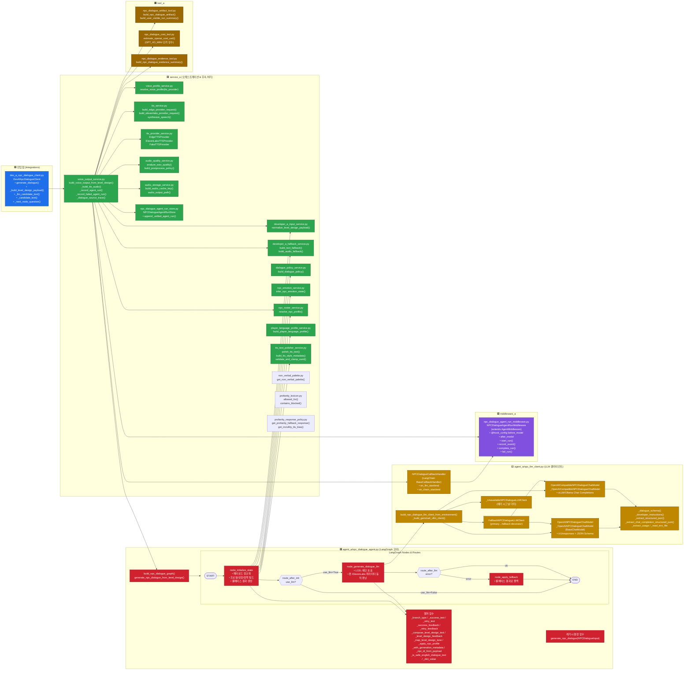
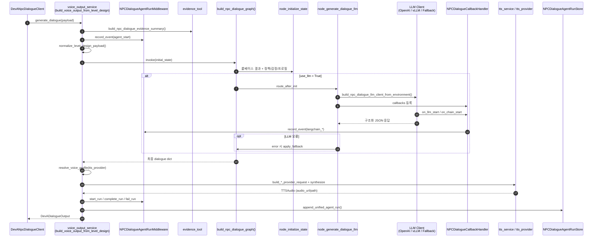

# Agent A (NPC Dialogue Agent) 구조도

> 개발자 A 소유의 `npc_dialogue_agent` 패키지 전체 구조를 한 눈에 볼 수 있도록 정리한 문서입니다.
> Middleware / Tool / Service / Integrations / LLM Client / LangGraph 노드 흐름을 모두 포함합니다.

---

## 1. 전체 아키텍처 (Mermaid)

---

## 2. 실행 순서 (Sequence)

---

## 3. 모듈 매핑 표

| 계층 | 파일 | 주요 클래스 / 함수 |
|---|---|---|
| **Integrations** | `integrations/dev_a_npc_dialogue_client.py` | `DevANpcDialogueClient.generate_dialogue` |
| **Service (오케스트레이션)** | `services/service_a/voice_output_service.py` | `build_voice_output_from_level_design`, `_build_tts_audio`, `_record_agent_run`, `_record_failed_agent_run` |
| **Service (입력/정책)** | `services/service_a/developer_a_input_service.py` | `normalize_level_design_payload` |
| | `services/service_a/dialogue_policy_service.py` | `build_dialogue_policy` |
| | `services/service_a/npc_emotion_service.py` | `infer_npc_emotion_state` |
| | `services/service_a/player_language_profile_service.py` | `build_player_language_profile` |
| | `services/service_a/npc_roster_service.py` | `resolve_npc_profile`, `NPCProfile` |
| | `services/service_a/developer_a_fallback_service.py` | `build_text_fallback`, `build_audio_fallback` |
| | `services/service_a/tts_text_polisher_service.py` | `polish_tts_text`, `build_tts_style_metadata`, `validate_and_clamp_ssml` |
| | `services/service_a/non_verbal_palette.py` | `get_non_verbal_palette` |
| | `services/service_a/profanity_lexicon.py` | `allowed_for`, `contains_blocked` |
| | `services/service_a/profanity_response_policy.py` | `get_profanity_fallback_response`, `get_incivility_tts_bias` |
| **Service (음성)** | `services/service_a/voice_profile_service.py` | `resolve_voice_profile` |
| | `services/service_a/tts_service.py` | `build_edge_provider_request`, `build_elevenlabs_provider_request`, `synthesize_speech` |
| | `services/service_a/tts_provider_service.py` | `EdgeTTSProvider`, `ElevenLabsTTSProvider`, `FakeTTSProvider` |
| | `services/service_a/audio_quality_service.py` | `analyze_wav_quality`, `build_postprocess_policy` |
| | `services/service_a/audio_storage_service.py` | `build_audio_cache_key`, `audio_output_path` |
| | `services/service_a/npc_dialogue_agent_run_store.py` | `NPCDialogueAgentRunStore.append_unified_agent_run` |
| **Agent 코어** | `agents/agent_a/npc_dialogue_agent.py` | `build_npc_dialogue_graph`, `generate_npc_dialogue_from_level_design`, `node_initialize_state`, `node_generate_dialogue_llm`, `node_apply_fallback`, `route_after_init`, `route_after_llm` |
| **LLM Client** | `agents/agent_a/npc_llm_client.py` | `OpenAINPCDialogueChatModel`, `OpenAICompatibleNPCDialogueChatModel`, `FallbackNPCDialogueLLMClient`, `NPCDialogueCallbackHandler`, `build_npc_dialogue_llm_client_from_environment`, `_render_developer_instructions` |
| **Middleware** | `middleware/middleware_a/npc_dialogue_agent_run_middleware.py` | `NPCDialogueAgentRunMiddleware` (`start_run`, `record_event`, `complete_run`, `fail_run`, `before_model`, `after_model`) |
| **Tool** | `tools/tool_a/npc_dialogue_artifact_tool.py` | `build_npc_dialogue_artifact`, `build_user_visible_run_summary` |
| | `tools/tool_a/npc_dialogue_cost_tool.py` | `estimate_openai_cost_usd` |
| | `tools/tool_a/npc_dialogue_evidence_tool.py` | `build_npc_dialogue_evidence_summary` |
