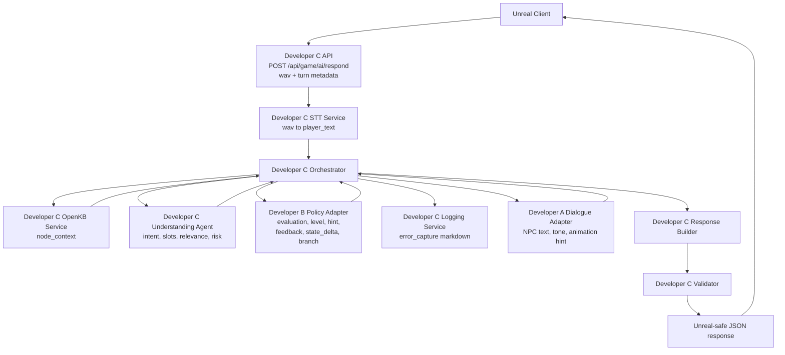

# Developer C Adapter Contracts

## Purpose

This document defines the adapter boundaries Developer C will implement around
STT, OpenKB, the Understanding Agent, Developer B policy, Developer A dialogue,
logging, response building, and validation.

The adapters let Developer C use deterministic mocks until real Developer A and
Developer B implementations are ready.

## Architecture

The current prototype assumes every Unreal turn arrives as a wav file. There is
no public Unreal `input_type`; Developer C always runs STT before semantic
understanding.

The AI-only pre-prototype uses JSON mock input instead of a real Unreal
multipart upload. That mock input still models a wav turn and flows through the
same STT, orchestrator, Understanding, Developer B, Developer A, response
builder, and validator stages.



The user's proposed flow is correct with one refinement: OpenKB retrieval,
response building, logging, and validation are Developer C-owned steps inside
the Orchestrator path.

```text
Unreal wav
  -> STT
  -> Orchestrator
  -> OpenKB node_context
  -> Understanding Agent
  -> Orchestrator
  -> Developer B Policy / Level / Hint / Feedback Agent
  -> Orchestrator
  -> Developer A NPC Dialogue Agent
  -> Orchestrator
  -> Response Builder
  -> Validator
  -> Unreal
```

## File Ownership

Developer C may implement these adapters under:

- `backend/app/services/stt_service.py`
- `backend/app/services/openkb_service.py`
- `backend/app/services/orchestrator.py`
- `backend/app/services/logging_service.py`
- `backend/app/services/response_builder.py`
- `backend/app/services/validator.py`
- `backend/app/agents/understanding_agent.py`
- `backend/app/integrations/dev_a_npc_dialogue_client.py`
- `backend/app/integrations/dev_b_level_hint_client.py`

Developer C must not import Developer A or Developer B implementation modules
unless a contract explicitly allows it. The C adapters may call mocks, local
fixtures, HTTP clients, or future plugin clients.

## STT Service Contract

Developer C service:

```text
transcribe_wav(audio, audio_metadata) -> normalized_input
```

Input:

```json
{
  "audio": {
    "mime_type": "audio/wav",
    "sample_rate_hz": 16000,
    "channels": 1,
    "duration_ms": 2800,
    "language_hint": "en-US"
  }
}
```

Output:

```json
{
  "player_text": "I'm here for tourism.",
  "input_source": {
    "input_type": "voice",
    "stt_confidence": 0.87,
    "language_detected": "en-US",
    "needs_repeat": false
  },
  "stt_model": "whisper-large-v3-turbo",
  "stt_primary_runtime": "local",
  "stt_fallback_runtime": "api",
  "stt_runtime_used": "local"
}
```

Rules:

- `input_source.input_type` is always `voice` in this prototype.
- The STT service is configured around `whisper-large-v3-turbo`.
- `MURPHY_STT_MODE=local` runs local Whisper first and calls API fallback only
  when the local runtime fails.
- The local runtime uses `openai-whisper` with local model alias `turbo` by
  default. This maps the runtime to Whisper large-v3-turbo while keeping the
  public contract model name `whisper-large-v3-turbo`.
- API fallback calls the OpenAI Transcriptions API with
  `MURPHY_STT_API_MODEL`, defaulting to `whisper-1`.
- `MURPHY_STT_MODE=mock` keeps deterministic sample-wav transcription for
  tests and contract demos.
- Tests must not require local model downloads or real STT provider
  credentials.

## OpenKB Service Contract

Developer C service:

```text
get_node_context(chapter_id, current_node_id) -> node_context
```

Output must include the Developer B-required node fields:

- `node_id`
- `npc_question`
- `required_intents`
- `required_slots`
- `recommended_expression`
- `hint_policy`
- `success_next_node`
- `retry_next_node`
- `clarify_next_node`
- `hint_next_node`
- `warning_next_node`
- `allowed_next_nodes`

Developer C may include extra fields for Understanding Agent evidence, such as
`allowed_slot_values` and `risk_keywords`.

## Understanding Agent Contract

Developer C component:

```text
analyze_player_text(player_text, node_context) -> understanding
```

Output:

```json
{
  "intent": "state_visit_purpose",
  "intent_success": true,
  "confidence": 0.94,
  "meaning_summary_kr": "The player said they are visiting for tourism.",
  "emotion": "nervous_humor",
  "answer_relevance": "on_topic",
  "ambiguity_type": "none",
  "risk_delta": 0,
  "risk_reason": "The purpose is clear and no risk expression was found.",
  "risk_tags": [],
  "extracted_slots": {
    "visit_purpose": "tourism"
  },
  "missing_slots": [],
  "needs_clarification": false
}
```

Rules:

- It returns semantic evidence only.
- It must not decide `next_node_id`.
- It must not generate final NPC dialogue.
- It must not generate turn scores or final hints.

## Developer B Policy Adapter

Developer C adapter target:

```text
evaluate_turn(dev_b_policy_input) -> dev_b_policy_output
```

Current file target:

```text
backend/app/integrations/dev_b_level_hint_client.py
```

The file name may remain for Phase 2 compatibility, but the adapter behavior is
now broader than level and hint. The logical adapter is:

```text
DevBPolicyClient
```

Input contract:

```text
dev_b_policy.v1
```

Developer C builds this input from:

- Unreal turn metadata
- STT normalized input
- OpenKB node context
- Understanding output
- previous node results
- client allowed next nodes

Required output fields:

- `contract_version`
- `node_id`
- `evaluation`
- `level_hint`
- `in_game_feedback`
- `error_capture`
- `out_game_feedback_seed`
- `branch`
- `state_delta`
- `report_item`

Optional output fields:

- `dialogue_directive`

Developer C must treat Developer B output as a recommendation until validation
passes.

### Developer B Output Validation

Developer C must validate:

- `contract_version == "dev_b_policy.v1"`
- `node_id == current_node_id`
- `branch.next_node_id in node_context.allowed_next_nodes`
- `branch.next_node_id in client_allowed_next_nodes` when that list exists
- `branch.next_action` uses a known enum
- `branch.branch_type` uses a known enum
- `state_delta` values are within contract ranges
- `error_capture.storage_format == "markdown"`
- `error_capture.markdown_entry == null` when `should_record` is false
- no Unreal command, camera event, or final response envelope is present

## Developer B Final Feedback Adapter

Developer C adapter target:

```text
build_out_game_feedback(final_feedback_input) -> final_feedback_output
```

Input is built after the episode from:

- stored markdown error log path
- stored markdown error log content
- node results
- OpenKB Focus on Form context

Developer C owns:

- markdown file storage
- path generation
- retention and privacy policy
- OpenKB retrieval execution
- final response assembly

Developer B owns:

- final recommendation policy
- out-game Focus on Form payload
- report scoring policy

## Developer A Dialogue Adapter

Developer C adapter target:

```text
generate_dialogue(dev_a_dialogue_input) -> dev_a_dialogue_output
```

Current file target:

```text
backend/app/integrations/dev_a_npc_dialogue_client.py
```

Input:

```json
{
  "contract_version": "dev_a_dialogue.v1",
  "request_id": "req_imm_0001",
  "session_id": "session_001",
  "current_node_id": "IMM_002_PURPOSE",
  "player_text": "I'm here for tourism.",
  "npc": {
    "npc_id": "OFFICER_MILLER",
    "npc_role": "immigration_officer",
    "last_npc_message": "What is the purpose of your visit?"
  },
  "node_context": {
    "node_id": "IMM_002_PURPOSE",
    "npc_question": "What is the purpose of your visit?",
    "recommended_expression": "I'm here for tourism."
  },
  "understanding": {
    "intent": "state_visit_purpose",
    "intent_success": true,
    "emotion": "nervous_humor",
    "answer_relevance": "on_topic"
  },
  "developer_b_policy": {
    "evaluation": {
      "verdict": "SUCCESS",
      "feedback_tags": [
        "intent_matched",
        "required_slot_filled"
      ]
    },
    "level_hint": {
      "english_level": "beginner",
      "recommended_expression": "I'm here for tourism."
    },
    "in_game_feedback": {
      "show": true,
      "feedback_strategy": "recast",
      "npc_recast_line_candidate": "You're here for tourism. How long will you stay?"
    },
    "branch": {
      "branch_type": "success",
      "next_action": "ADVANCE",
      "next_node_id": "IMM_003_DURATION"
    },
    "dialogue_directive": {
      "purpose": "continue_to_next_question",
      "tone_hint": "neutral",
      "target_slot": "stay_duration",
      "do_not_generate_npc_text": true
    }
  }
}
```

Output:

```json
{
  "contract_version": "dev_a_dialogue.v1",
  "speaker": "Officer Miller",
  "text": "You're here for tourism. How long will you stay?",
  "tone": "formal_neutral",
  "animation": "officer_check_passport",
  "feedback_kr": "Good. A natural sentence is: I'm here for tourism."
}
```

Rules:

- Developer A output is dialogue content, not branch authority.
- Developer A must not change `next_node_id`, `next_action`, or `state_delta`.
- Developer C may replace Developer A with a deterministic mock until real
  Developer A is ready.
- Developer C validates text safety, known animation ids, and response size
  before returning to Unreal.

## Logging Adapter

Developer C service:

```text
record_error_capture(session_id, error_capture) -> recorded_error_summary
```

Input:

```json
{
  "should_record": true,
  "storage_format": "markdown",
  "markdown_entry": "### IMM_002_PURPOSE - err_imm_002_001\n- Original: I here tourism."
}
```

Output:

```json
{
  "recorded": true,
  "storage_format": "markdown",
  "error_log_markdown_path": "logs/session_001/error_log.md",
  "recorded_error_count": 1
}
```

Rules:

- Developer B proposes markdown.
- Developer C stores markdown.
- Markdown is not direct in-game UI text.
- Tests must pass without persistent external storage.

## Response Builder Contract

Developer C service:

```text
build_unreal_response(turn_context) -> unreal_response
```

Inputs:

- validated Developer B output
- validated Developer A output
- normalized input metadata
- current session and node metadata
- logging summary

Output contract:

```text
dev_c_unreal_response.v1
```

The response builder assembles fields. It does not bypass validation.

## Validator Contract

Developer C service:

```text
validate_turn_response(turn_context, unreal_response) -> validation_result
```

Output:

```json
{
  "is_valid": true,
  "issues": []
}
```

Rules:

- Validator is rule-based.
- Validator runs after Developer B output and before final Unreal response.
- Validator must catch invalid branch transitions even if Developer B says
  `allowed_next_node_checked` is true.
- Validator must catch any Developer A attempt to alter branch or state.

## Legacy Mapping Notes

The older Developer B start prompt used a smaller payload. The new canonical
contract uses these mappings:

| Older field | New canonical field |
| --- | --- |
| `game_state.risk_score` | `scenario_state.suspicion` |
| `branch.reason` | `branch.branch_reason` |
| `END_BAD_HANDCUFF` | `END_SECONDARY_INSPECTION` |
| B output only `level_hint` and `branch` | B output includes evaluation, feedback, error capture, state delta, and report item |
