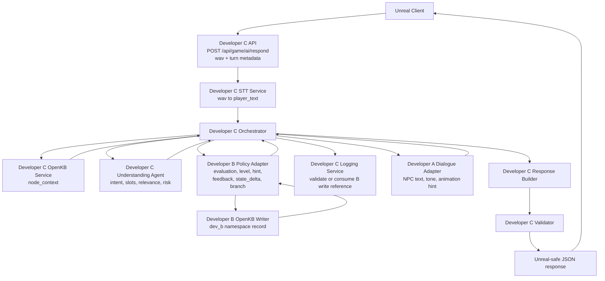

# Developer C Adapter Contracts

## Purpose

This document defines the adapter boundaries Developer C will implement around
STT, OpenKB, the Understanding Agent, Developer B policy, Developer A dialogue,
logging, response building, and validation.

The adapters let Developer C keep orchestration and validation ownership while
calling merged Developer A and Developer B implementations. Automated tests use
deterministic STT and fake Kokoro voice output so the pre-prototype remains
key-free and reproducible.

Runtime provider modes are controlled by Developer C settings:

```text
MURPHY_STT_MODE=mock|local
MURPHY_UNDERSTANDING_MODE=rule|llm
MURPHY_TTS_MODE=fake|real
MURPHY_NPC_DIALOGUE_MODE=rule|llm
```

The default test-safe mode is `mock`, `rule`, `fake`, and `rule`. The endpoint
demo can enable local Whisper, real Understanding AI, and real Kokoro without
changing the public response contract.

## Architecture

The current prototype assumes every Unreal turn arrives as a wav file. There is
no public Unreal `input_type`; Developer C always runs STT before semantic
understanding.

The AI-only pre-prototype uses JSON mock input instead of a real Unreal
multipart upload. That mock input still models a wav turn and flows through the
same STT, orchestrator, Understanding, Developer B, Developer A, response
builder, and validator stages.



The user's proposed flow is correct with one refinement: OpenKB retrieval,
response building, logging, and validation are Developer C-owned steps inside
the Orchestrator path.

Developer C now implements that path as a LangGraph v1.2.2 workflow. The
compiled graph in `backend/app/graphs/graph.py` owns the node order and shared
state shape. Concrete C-owned work happens through graph-style tool wrappers in
`backend/app/tools/tool_c/developer_c_graph_tools.py`. The public
`Orchestrator.run_turn()` method remains as a thin compatibility entry point
that invokes the graph.

```text
Unreal wav
  -> STT
  -> Orchestrator
  -> OpenKB node_context
  -> Understanding Agent
  -> Orchestrator
  -> Developer B Policy / Level / Hint / Feedback Agent
  -> Developer B OpenKB dev_b namespace write
  -> Orchestrator
  -> Developer A NPC Dialogue Agent
  -> Orchestrator
  -> Response Builder
  -> Validator
  -> Unreal
```

## Alpha Interaction Direction

Alpha keeps the existing wav turn endpoint as the stable baseline, but the turn
metadata now includes an additive C-owned `interaction` context:

- `initiator`: `npc` for fixed-prompt NPC-first turns, `player` for the player
  walking up and speaking first.
- `interaction_type`: `quest`, `ambient`, `tutorial`, or `system`.
- `quest_id` and `interaction_id`: optional client ids for quest and
  interactable correlation.
- `time_limit_s`: optional timer metadata such as the 30-second immigration
  answer window.

Developer C echoes this metadata in `dev_c_unreal_response.v1` and includes it
in safe AgentRun summaries. The field does not change Developer B branch
authority or Developer A dialogue/TTS ownership.

Developer C also records diagnostic `debug.timing_ms` values for STT, OpenKB,
Understanding, Developer B, C logging, Developer A/TTS, response building, and
validation. Timing values are for Alpha latency analysis only and must not be
used as gameplay branch decisions.

Developer C now also emits additive `flow` metadata with contract version
`dev_c_unreal_flow.v1`. This is Unreal presentation guidance for scene
transitions, cutscenes, skip eligibility, and scoreboard display. It does not
replace Developer B branch authority.

## File Ownership

Developer C may implement these adapters under:

- `backend/app/services/service_c/stt_service.py`
- `backend/app/services/service_c/openkb_service.py`
- `backend/app/services/service_c/orchestrator.py`
- `backend/app/graphs/graph.py`
- `backend/app/tools/tool_c/`
- `backend/app/services/service_c/logging_service.py`
- `backend/app/services/service_c/response_builder.py`
- `backend/app/services/service_c/validator.py`
- `backend/app/agents/agent_c/understanding_agent.py`
- `backend/app/integrations/dev_a_npc_dialogue_client.py`
- `backend/app/integrations/dev_b_level_hint_client.py`

Developer C must not import Developer A or Developer B implementation modules
outside the C-owned adapter boundary. The current C adapters call
`backend.app.agents.agent_b.EnglishLevelHintAgent` and Developer A's
`build_voice_output_from_level_design()` service.

## STT Service Contract

Developer C service:

```text
transcribe_wav(audio, audio_metadata) -> normalized_input
```

Input:

```json
{
  "audio": {
    "mime_type": "audio/wav",
    "sample_rate_hz": 16000,
    "channels": 1,
    "duration_ms": 2800,
    "language_hint": "en-US"
  }
}
```

Output:

```json
{
  "player_text": "I'm here for tourism.",
  "input_source": {
    "input_type": "voice",
    "stt_confidence": 0.87,
    "language_detected": "en-US",
    "needs_repeat": false
  },
  "stt_model": "whisper-large-v3-turbo",
  "stt_primary_runtime": "local",
  "stt_fallback_runtime": "api",
  "stt_runtime_used": "local"
}
```

Rules:

- `input_source.input_type` is always `voice` in this prototype.
- The STT service is configured around `whisper-large-v3-turbo`.
- STT runtime settings are loaded through
  `backend/app/services/service_c/settings_service.py`, which reads environment
  variables and `.env`.
- `MURPHY_STT_MODE=local` runs local Whisper first and calls API fallback only
  when the local runtime fails.
- The local runtime uses `openai-whisper` with local model alias `turbo` by
  default. This maps the runtime to Whisper large-v3-turbo while keeping the
  public contract model name `whisper-large-v3-turbo`.
- API fallback calls the OpenAI Transcriptions API with
  `MURPHY_STT_API_MODEL`, defaulting to `whisper-1`.
- `MURPHY_STT_MODE=mock` keeps deterministic sample-wav transcription for
  tests and contract demos.
- Tests must not require local model downloads or real STT provider
  credentials.

## Alpha Realtime Caption Transport

For realtime STT captions in Unreal, Developer C now exposes a provider-neutral
transcript WebSocket beside the existing batch `/respond` endpoint. This does
not replace the stable wav request immediately.

Implemented Alpha 3C structure:

```text
Unreal microphone
  -> Developer C WebSocket /api/game/ai/stt/stream
  -> ElevenLabs WSS /v1/speech-to-text/realtime
  -> Developer C subtitle event mapping
  -> Unreal subtitle UI

Unreal final commit or stop speaking
  -> Developer C final_transcript event
  -> existing /respond fallback path with committed transcript
  -> Developer B policy
  -> Developer A dialogue/TTS
  -> Unreal response JSON
```

Client event shape for the C-owned WebSocket stays small and provider-neutral:

```json
{
  "contract_version": "dev_c_realtime_stt.v1",
  "event_type": "audio_chunk",
  "request_id": "req_realtime_0001",
  "session_id": "session_realtime_001",
  "turn_index": 3,
  "sequence": 1,
  "provider": "elevenlabs_relay",
  "audio_base64": "UklGRiQAAABXQVZFZm10IBAAAAABAAEA",
  "commit": false,
  "sample_rate_hz": 16000
}
```

```json
{
  "contract_version": "dev_c_realtime_stt.v1",
  "event_type": "final_transcript",
  "request_id": "req_realtime_0001",
  "session_id": "session_realtime_001",
  "turn_index": 3,
  "sequence": 2,
  "provider": "elevenlabs_relay",
  "subtitle": {
    "text": "I will stay for five days.",
    "is_final": true,
    "display_mode": "replace"
  },
  "committed": true,
  "target_endpoint": "POST /api/game/ai/respond"
}
```

Rules:

- Unreal must not hold provider API keys. Alpha now uses the Developer C relay
  path with `ELEVENLABS_API_KEY` kept in the backend `.env`.
- `session_start.provider = "elevenlabs_relay"` opens a backend outbound WSS
  connection to ElevenLabs realtime STT with `xi-api-key` in the provider
  header.
- `audio_chunk` events are base64 PCM chunks. The current smoke-test path
  expects 16 kHz mono 16-bit PCM wav chunks and sends
  `audio_format=pcm_16000`.
- In manual commit mode, set `commit = true` on the final real audio chunk for
  the utterance. Do not end the turn by sending a separate silence-only commit
  chunk.
- Developer C waits up to `ELEVENLABS_REALTIME_COMMIT_TIMEOUT_S` for a
  committed provider final before falling back to local batch STT.
- Partial transcripts are UI-only subtitle previews and must not call Developer
  B or Developer A.
- Only committed final transcripts may enter the normal C orchestrator path.
- Recommended Alpha runtime: use ElevenLabs realtime relay as the primary
  caption path and keep the existing local Whisper STT runtime as a
  batch-on-commit fallback. The local runtime can recover a final transcript
  from buffered PCM when the provider fails or returns no final transcript, but
  it does not provide partial streaming subtitles.
- Fallback final events use `provider = "local_batch_fallback"` and still set
  `target_endpoint = "POST /api/game/ai/respond"` so Unreal can reuse the
  existing committed transcript path.
- `MURPHY_STT_DEBUG_LOG_MODE=debug` appends a C-owned
  `realtime_stt_relay` record to the shared unified AgentRun JSONL/Markdown
  logs. The record includes chunk count, audio bytes, estimated duration,
  primary/fallback provider metadata, final transcript summary, token counts
  fixed at zero, and an estimated cost derived from
  `ELEVENLABS_REALTIME_ESTIMATED_COST_PER_MINUTE_USD`.
- Alpha 3C does not yet pipe the WebSocket final event directly into the
  orchestrator. It returns `target_endpoint = "POST /api/game/ai/respond"` so
  Unreal can reuse the existing committed transcript fallback.
- The first event must be `session_start`; later transcript events must use a
  monotonically increasing `sequence`.
- The existing multipart wav `/respond` path remains the fallback and contract
  baseline until realtime STT is verified.
- UDP is not the first Alpha choice for captions because ordering, loss
  recovery, auth, and commit semantics would become C/Unreal-owned protocol
  work. WebSocket gives bidirectional ordered messages that match partial and
  committed transcript events.

Manual solo smoke test:

```powershell
Copy-Item .env.example .env
# Fill ELEVENLABS_API_KEY in .env
uv run uvicorn backend.app.main:app --reload
uv run python scripts/smoke_elevenlabs_realtime_stt_relay.py --wav path\to\mono_16k_pcm.wav
```

## OpenKB Service Contract

Developer C service:

```text
get_node_context(chapter_id, current_node_id) -> node_context
```

Output must include the Developer B-required node fields:

- `node_id`
- `npc_question`
- `required_intents`
- `required_slots`
- `recommended_expression`
- `hint_policy`
- `success_next_node`
- `retry_next_node`
- `clarify_next_node`
- `hint_next_node`
- `warning_next_node`
- `allowed_next_nodes`

Developer C may include extra fields for Understanding Agent evidence, such as
`allowed_slot_values` and `risk_keywords`.

## Understanding Agent Contract

Developer C component:

```text
analyze_player_text(player_text, node_context) -> understanding
```

Runtime modes:

- `MURPHY_UNDERSTANDING_MODE=rule` uses the deterministic local analyzer.
- `MURPHY_UNDERSTANDING_MODE=llm` calls Developer C's configured LLM-backed
  semantic analyzer and falls back to rule mode on missing API key, request
  failure, invalid JSON, schema failure, or forbidden authority fields.
- `MURPHY_UNDERSTANDING_LLM_PROVIDER` defaults to `openai`.
- `MURPHY_UNDERSTANDING_LLM_FALLBACK=gemma4_vllm` tries the academy Gemma4
  vLLM OpenAI-compatible server after the primary OpenAI client is unavailable.
- Gemma4 fallback uses `GEMMA4_VLLM_BASE_URL`,
  `GEMMA4_VLLM_MODEL`, and `GEMMA4_VLLM_API_KEY`.
- `MURPHY_UNDERSTANDING_LLM_MODEL` defaults to `gpt-4o-mini`.
- `MURPHY_UNDERSTANDING_LLM_TIMEOUT_SECONDS` defaults to `10`.

Output:

```json
{
  "intent": "state_visit_purpose",
  "intent_success": true,
  "confidence": 0.94,
  "meaning_summary_kr": "The player said they are visiting for tourism.",
  "emotion": "nervous_humor",
  "answer_relevance": "on_topic",
  "ambiguity_type": "none",
  "risk_delta": 0,
  "risk_reason": "The purpose is clear and no risk expression was found.",
  "risk_tags": [],
  "slot_evidence": [
    {
      "slot": "visit_purpose",
      "value": "tourism",
      "confidence": 0.94,
      "evidence_text": "tourism"
    }
  ],
  "extracted_slots": {
    "visit_purpose": "tourism"
  },
  "missing_slots": [],
  "needs_clarification": false
}
```

Rules:

- It returns semantic evidence only.
- It must not decide `next_node_id`.
- It must not generate final NPC dialogue.
- It must not generate turn scores or final hints.
- LLM output must not include branch, next action, state delta, scores, hints,
  NPC dialogue, TTS text, or Unreal commands.
- The Understanding Agent exposes `last_trace` after each analysis call. In
  LLM mode this trace contains a `tool_call` summary for
  `understanding_llm_client.analyze`; when LLM output is unavailable or unsafe,
  the trace records fallback mode and the rule output summary.
- LLM fallback failures are logged through the C runtime logger before rule
  fallback is used.
- The OpenAI structured output schema uses strict-compatible objects. Legacy
  `visit_purpose` and `stay_duration` slot values are still represented as
  required nullable schema fields, then normalized back into
  `extracted_slots: dict[str, str]` before Pydantic validation.
- Alpha 2 generic slots are represented as `slot_evidence` items. Developer C
  accepts only slot names present in the current `node_context.required_slots`,
  `optional_slots`, or `critical_slots`, drops unrelated names, and converts the
  accepted evidence into `extracted_slots` for Developer B.
- In LLM mode, Developer C still applies narrow deterministic repairs for
  current regression guards. If the current node requires `visit_purpose` or
  `stay_duration`, the LLM leaves that slot missing, no risk expression is
  present, and the deterministic guard detects a clear value such as `uncle ->
  family_visit` or `5 days`, C repairs the Understanding output before sending
  it to Developer B. This is recorded in `last_trace.postprocessing` and is not
  counted as LLM fallback.
- Rule fallback recognizes the current `visit_purpose` allowed values:
  `family_visit`, `friend_visit`, `business`, `study`, `transit`, and
  `tourism`.
- Developer C writes the Understanding trace inside the orchestrator's unified
  AgentRun record rather than creating a separate log file.

## Developer B Policy Adapter

Developer C adapter target:

```text
evaluate_turn(dev_b_policy_input) -> dev_b_policy_output
```

Current file target:

```text
backend/app/integrations/dev_b_level_hint_client.py
```

The file name may remain for Phase 2 compatibility, but the adapter behavior is
now broader than level and hint. The logical adapter is:

```text
DevBPolicyClient
```

Input contract:

```text
dev_b_policy.v1
```

Developer C builds this input from:

- Unreal turn metadata
- STT normalized input
- OpenKB node context
- Understanding output
- previous node results
- client allowed next nodes

Required output fields:

- `contract_version`
- `node_id`
- `evaluation`
- `level_hint`
- `in_game_feedback`
- `error_capture`
- `out_game_feedback_seed`
- `branch`
- `state_delta`
- `report_item`

Optional output fields:

- `dialogue_directive`
- `report_seed_summary`
- `dialogue_seed`
- `openkb_write`
- `rubric_scores`
- `difficulty_profile`
- `feedback_generation`

Developer C must treat Developer B output as a recommendation until validation
passes.

Current implementation:

```text
backend/app/integrations/dev_b_level_hint_client.py
  -> backend.app.agents.agent_b.EnglishLevelHintAgent.evaluate_turn()
```

### Developer B Output Validation

Developer C must validate:

- `contract_version == "dev_b_policy.v1"`
- `node_id == current_node_id`
- `branch.next_node_id in node_context.allowed_next_nodes`
- `branch.next_node_id in client_allowed_next_nodes` when that list exists
- `branch.next_action` uses a known enum
- `branch.branch_type` uses a known enum
- `state_delta` values are within contract ranges
- `error_capture.storage_format == "markdown"`
- `error_capture.markdown_entry == null` when `should_record` is false
- `level_hint.hint_type == null` and `level_hint.hint_kr == null` when
  `level_hint.needs_hint` is false
- feedback strategy-specific candidate fields are present
- `out_game_feedback_seed.focus_on_form_targets` is non-empty when final report
  inclusion is requested
- `report_seed_summary` is optional seed metadata and is not treated as a final
  result UI payload
- `dialogue_seed` is optional A-facing generation metadata and must not contain
  final NPC utterance fields such as `npc_text`, `npc_utterance`, or
  `final_dialogue_line`
- `openkb_write.namespace == "dev_b"` when a write reference is present
- successful `openkb_write` references point to expected local OpenKB runtime
  paths and do not escape the B-owned namespace
- `rubric_scores.total` is between 0 and 12 when present
- `feedback_generation.mode` is `rule`, `llm`, or `fallback` when present
- `difficulty_profile` is learning metadata and must not affect branch
  validation
- no Unreal command, camera event, or final response envelope is present

## Developer B Final Feedback Adapter

Developer C adapter target:

```text
build_out_game_feedback(final_feedback_input) -> final_feedback_output
```

Input is built after the episode from:

- stored markdown error log path
- stored markdown error log content
- node results
- OpenKB Focus on Form context

Developer C owns:

- path generation
- retention and privacy policy
- OpenKB retrieval execution
- final response assembly

Implemented pre-prototype final score bridge:

```text
DevBPolicyClient.final_result_for_session(session_id) -> FinalResult
DevBPolicyClient.out_game_feedback_for_session(session_id) -> dict
```

Rules:

- Developer B owns `FinalResultScorePolicy` and the numeric scoring policy.
- Developer B owns `FocusOnFormReportPolicy` and the out-game Focus-on-Form
  learning-card payload shape.
- Developer C may read B-owned runtime records through the Developer B adapter
  and may not mutate records under `backend/runtime/openkb/dev_b/`.
- Final-branch `evaluate_turn(...)` may attach `DevBPolicyOutput.final_result`
  only for the Alpha final scoreboard node `ALPHA_999_FINAL_SCOREBOARD`.
  `IMM_007_FINAL_DECISION` is treated as an immigration-to-baggage transition.
- `GET /api/game/ai/result/{session_id}` returns
  `dev_c_unreal_result.v1` with the validated B `final_result` and optional
  B-owned `out_game_feedback` learning metadata.
- `/api/game/ai/respond` includes the same object under
  `report.final_result` when B returns it on a final branch.
- `out_game_feedback` is not branch, verdict, next-node, state-delta, or score
  authority. Unreal should render it as final learning-card UI only.

Developer B owns:

- final recommendation policy
- out-game Focus on Form payload
- report scoring policy
- OpenKB `dev_b` namespace feedback/error runtime writes

## Developer C Demo Diagnostics

Developer C exposes demo-only helpers for local browser testing. These endpoints
do not change the Unreal turn or response contract.

Routes:

- `GET /respond-dialog` serves the C-owned multi-turn browser tester.
- `GET /api/game/ai/demo/node/{node_id}` returns safe Chapter 0 node context
  fields used by the browser tester to prepare the next turn payload.
- `GET /api/game/ai/agent-runs/session-usage?session_id=<optional>&request_ids=<optional repeated>`
  sums unified AgentRun `model` usage by session, optionally restricted to the
  provided request ids.

Session usage counts only each record's top-level `model` object so nested event
traces are not counted twice. It accepts the canonical unified keys
`input_tokens`, `output_tokens`, `total_tokens`, and `estimated_cost_usd`, and
also normalizes OpenAI-compatible aliases such as `prompt_tokens`,
`completion_tokens`, and `cost_usd`.

## Developer A Dialogue Adapter

Developer C adapter target:

```text
generate_dialogue(dev_a_dialogue_input) -> dev_a_dialogue_output
```

Current file target:

```text
backend/app/integrations/dev_a_npc_dialogue_client.py
```

Input:

```json
{
  "contract_version": "dev_a_dialogue.v1",
  "request_id": "req_imm_0001",
  "session_id": "session_001",
  "current_node_id": "IMM_002_PURPOSE",
  "player_text": "I'm here for tourism.",
  "npc": {
    "npc_id": "OFFICER_MILLER",
    "npc_role": "immigration_officer",
    "last_npc_message": "What is the purpose of your visit?"
  },
  "node_context": {
    "node_id": "IMM_002_PURPOSE",
    "npc_question": "What is the purpose of your visit?",
    "recommended_expression": "I'm here for tourism."
  },
  "understanding": {
    "intent": "state_visit_purpose",
    "intent_success": true,
    "emotion": "nervous_humor",
    "answer_relevance": "on_topic"
  },
  "transition": null,
  "developer_b_policy": {
    "npc_emotion": "Nomal",
    "evaluation": {
      "verdict": "SUCCESS",
      "feedback_tags": [
        "intent_matched",
        "required_slot_filled"
      ]
    },
    "level_hint": {
      "english_level": "beginner",
      "recommended_expression": "I'm here for tourism."
    },
    "in_game_feedback": {
      "show": true,
      "feedback_strategy": "recast",
      "npc_recast_line_candidate": "You're here for tourism. How long will you stay?"
    },
    "branch": {
      "branch_type": "success",
      "next_action": "ADVANCE",
      "next_node_id": "IMM_003_DURATION"
    },
    "dialogue_seed": {
      "scene": "JFK_IMMIGRATION_HALL",
      "npc_role": "immigration_officer",
      "surface_goal": "ask_visit_purpose",
      "hidden_assessment_goal": "estimate_user_travel_speaking_level",
      "opening_intent": "ask_visit_purpose",
      "assessment_targets": ["state_visit_purpose", "visit_purpose"],
      "required_slots": ["visit_purpose"],
      "max_turns": 4,
      "difficulty_profile": "auto",
      "feedback_focus": ["visit_purpose"],
      "tone_guidance": "neutral",
      "allowed_followup_intents": ["advance_to_next_prompt"],
      "stop_condition": "required_slots_filled_or_retry_policy_triggered"
    },
    "dialogue_directive": {
      "purpose": "continue_to_next_question",
      "tone_hint": "neutral",
      "target_slot": "stay_duration",
      "do_not_generate_npc_text": true
    }
  }
}
```

Output:

```json
{
  "contract_version": "dev_a_dialogue.v1",
  "speaker": "Officer Miller",
  "text": "You're here for tourism. How long will you stay?",
  "tone": "formal_neutral",
  "animation": "officer_check_passport",
  "feedback_kr": "Good. A natural sentence is: I'm here for tourism.",
  "audio_url": "/runtime/audio/edge/IMM_002_PURPOSE_stay_duration_success_en-US-GuyNeural_abcd1234.wav",
  "diagnostics": []
}
```

Rules:

- Developer A output is dialogue content, not branch authority.
- Developer A must not change `next_node_id`, `next_action`, or `state_delta`.
- Developer C passes Developer B `npc_emotion` to Developer A as
  `npc.emotion` and returns the same value to Unreal as response
  `npc.emotion`.
- When `developer_b_policy.branch.next_action` is `COMPLETE_CHAPTER`,
  Developer C passes additive `transition` metadata to the A-facing payload so
  Developer A can choose closing dialogue tone. Developer A may ignore this
  field, but must not treat it as branch authority.
- Developer C passes Developer B's optional `dialogue_seed` through the
  A-facing level-design payload so Developer A can generate Alpha
  non-immigration dialogue from role, surface-goal, assessment, and stop
  condition metadata instead of B-authored final NPC wording.
- Developer C passes optional `game_state.random_customs_item` through the
  A-facing level-design payload as `random_customs_item`. This lets Developer A
  generate BAG_006 customs-item dialogue about the same item Unreal revealed.
- Developer C normalizes BAG A-facing NPC context by phase before calling
  Developer A: `BAG_001` through `BAG_004` use `BAGGAGE_STAFF /
  baggage_service_staff`, while `BAG_005` through `BAG_007` use
  `CUSTOMS_OFFICER / customs_officer`.
- Developer C adds a non-blocking `npc_speaker_mismatch` diagnostic when the
  speaker returned by Developer A shares no useful identity token with the
  A-facing `npc_id`. The diagnostic is copied into Unreal `debug.diagnostics`
  and AgentRun summaries; it does not rewrite A dialogue or change B branch
  policy.
- Developer C calls Developer A's voice output service with fake Edge by
  default for deterministic tests.
- `MURPHY_TTS_MODE=real` makes the C adapter pass `use_real_tts=True` to
  Developer A's voice output service.
- `MURPHY_NPC_DIALOGUE_MODE=llm` makes the C adapter pass
  `use_llm_dialogue=True` to Developer A's dialogue path. This optional mode
  requires the OpenAI dialogue environment expected by Developer A.
- Developer C validates text safety, known animation ids, and response size
  before returning to Unreal.
- Developer C serves generated pre-prototype wav artifacts from
  `/runtime/audio/...`, backed by `backend/runtime/generated/audio`.

## Logging Adapter

Developer C service:

```text
record_error_capture(session_id, error_capture) -> recorded_error_summary
```

Input:

```json
{
  "should_record": true,
  "storage_format": "markdown",
  "markdown_entry": "### IMM_002_PURPOSE - err_imm_002_001\n- Original: I here tourism."
}
```

Output:

```json
{
  "recorded": true,
  "storage_format": "markdown",
  "error_log_markdown_path": "logs/session_001/error_log.md",
  "recorded_error_count": 1
}
```

Rules:

- Developer B proposes markdown.
- Developer B stores feedback/error markdown under the OpenKB `dev_b`
  namespace when `openkb_write.succeeded == true`.
- Developer C must not create duplicate markdown for the same B write record.
- Developer C may keep a compatibility logging summary for final response
  counts and should consume the B `openkb_write` reference when present.
- Markdown is not direct in-game UI text.
- Tests must pass without persistent external storage.

Developer C also appends one orchestration-level unified AgentRun record per
turn:

```text
backend/runtime/generated/agent_runs/unified_agent_runs.jsonl
backend/runtime/generated/agent_runs/unified_agent_runs.md
```

The record uses:

```json
{
  "schema_version": "unified_agent_run.v1",
  "agent_name": "ai_backend_orchestrator",
  "owner": "developer_c"
}
```

Rules:

- C-owned `middleware_c` constructs C events and data-flow summaries.
- The shared writer only appends records and renders Markdown.
- Events are recorded at the STT, OpenKB, Understanding, Developer B,
  validator, error-capture, Developer A, response-builder, and final validator
  boundaries.
- Safe summaries include the Alpha `interaction` metadata and timing breakdown
  so A/B/C can distinguish NPC-first quest turns from player-first quest or
  ambient turns during review.
- The log must not include wav bytes, API keys, or full provider prompts.
- When Developer C directly calls the Understanding LLM and the provider
  returns token usage, the unified record's top-level `model` object stores
  `model_name`, `input_tokens`, `output_tokens`, `total_tokens`, and
  `estimated_cost_usd`.
- The same token/cost summary is also copied into the Understanding trace so
  the exact paid tool boundary is visible in the event timeline.
- Developer C does not estimate Developer A or Developer B costs inside the C
  orchestration record. Those costs belong in each owner's own AgentRun record.
- `metadata.data_flow` stores safe summaries of payload movement between
  agents/services so JSON flow can be debugged from the AI backend side.

## Response Builder Contract

Developer C service:

```text
build_unreal_response(turn_context) -> unreal_response
```

Inputs:

- validated Developer B output
- validated Developer A output
- normalized input metadata
- current session and node metadata
- C-owned Alpha interaction metadata
- C-owned Alpha flow metadata
- C-owned diagnostic timing metadata
- logging summary

Output contract:

```text
dev_c_unreal_response.v1
```

The response builder assembles fields. It does not bypass validation.

## Validator Contract

Developer C service:

```text
validate_turn_response(turn_context, unreal_response) -> validation_result
```

Output:

```json
{
  "is_valid": true,
  "issues": []
}
```

Rules:

- Validator is rule-based.
- Validator runs after Developer B output and before final Unreal response.
- Validator must catch invalid branch transitions even if Developer B says
  `allowed_next_node_checked` is true.
- Validator must catch any Developer A attempt to alter branch or state.
- Validator must require `npc.audio_url` under `/runtime/audio/...` for the
  integrated pre-prototype response.

## Legacy Mapping Notes

The older Developer B start prompt used a smaller payload. The new canonical
contract uses these mappings:

| Older field | New canonical field |
| --- | --- |
| `game_state.risk_score` | `scenario_state.suspicion` |
| `branch.reason` | `branch.branch_reason` |
| `END_BAD_HANDCUFF` | `END_SECONDARY_INSPECTION` |
| B output only `level_hint` and `branch` | B output includes evaluation, feedback, error capture, state delta, and report item |
