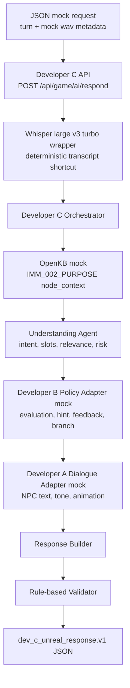
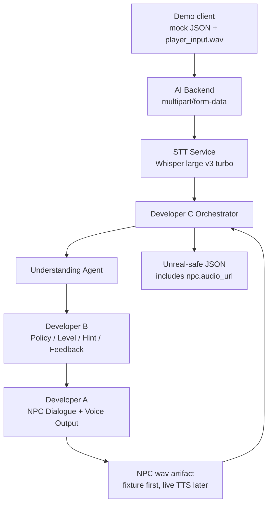

# Pre-Prototype Status and Demo Plan

## Audience

This document is for Developer A, Developer B, and Developer C. It summarizes
the current development phase, the AI-only pre-prototype architecture, and the
planned demo setup before Unreal Engine is connected.

## Current Phase Status

Completed:

- Phase 1: Developer C FastAPI backend harness.
- Phase 2: Developer C-side schemas and mock adapter boundaries.
- Phase 3, pre-prototype version: JSON mock request endpoint at
  `POST /api/game/ai/respond`.
- Phase 4, partial: Developer C Orchestrator, OpenKB mock, and Understanding
  Agent are connected for `IMM_002_PURPOSE`.
- Phase 5, partial: Developer B policy adapter mock is connected through the
  `dev_b_policy.v1` shape.
- Phase 6, partial: Developer A dialogue adapter mock and Developer C response
  builder are connected.
- Phase 7, minimum: Branch and response validation exists for the happy-path
  mock flow.

Not completed yet:

- Real wav byte transcription through Whisper large v3 turbo.
- Real Developer A NPC dialogue/TTS implementation.
- Real Developer B policy/level/hint/feedback implementation.
- Full Chapter 0 OpenKB node coverage.
- Multipart Unreal-style request handling.
- NPC response wav generation or fixture artifact response.
- Out-game feedback logging and final report flow.
- End-to-end retry, bad-ending, and STT fallback demos.

## Pre-Prototype Goal

The pre-prototype goal is to show that the three AI developers can collaborate
through contracts before Unreal integration.

The demo should prove one full turn:

```text
mock turn JSON + player wav
  -> AI backend
  -> STT transcript
  -> Developer C Orchestrator
  -> Developer C Understanding Agent
  -> Developer B policy result
  -> Developer A NPC response
  -> Developer C response builder and validator
  -> Unreal-safe JSON + NPC response wav reference
```

Current implementation already proves the same flow with JSON mock audio data.
The next demo step is to replace the JSON transcript shortcut with a real wav
file boundary while keeping deterministic tests available.

## Current AI-Only Flow



## Target Demo Flow



## Demo Request Shape

Target demo transport:

```text
POST /api/game/ai/respond
Content-Type: multipart/form-data
```

Parts:

| Part | Type | Owner | Purpose |
| --- | --- | --- | --- |
| `turn` | JSON | Demo client / Developer C | Mock Unreal turn state |
| `audio` | `audio/wav` file | Demo client | Player voice answer |

Example command:

```powershell
curl.exe -X POST http://127.0.0.1:8000/api/game/ai/respond `
  -F "turn=<demo/input/imm_002_purpose.json;type=application/json" `
  -F "audio=@samples/utterance-20260603-163237.wav;type=audio/wav"
```

Suggested demo fixture layout:

```text
samples/
  utterance-20260603-163237.wav

demo/
  input/
    imm_002_purpose.json
  npc_voice/
    officer_miller_imm_003_duration.wav

artifacts/
  demo/
    session_001/
      turn_2_officer_miller.wav
```

## Demo Response Shape

The demo response should keep the existing `dev_c_unreal_response.v1` contract
and add an NPC audio reference when voice output is available.

Target demo response excerpt:

```json
{
  "contract_version": "dev_c_unreal_response.v1",
  "request_id": "req_imm_0001",
  "current_node_id": "IMM_002_PURPOSE",
  "next_node_id": "IMM_003_DURATION",
  "next_action": "ADVANCE",
  "stt": {
    "model": "whisper-large-v3-turbo",
    "player_text": "I'm here for tourism.",
    "confidence": 0.87
  },
  "npc": {
    "speaker": "Officer Miller",
    "text": "You're here for tourism. How long will you stay?",
    "tone": "formal_neutral",
    "animation": "officer_check_passport",
    "audio_url": "/artifacts/demo/session_001/turn_2_officer_miller.wav"
  },
  "ui": {
    "recommended_expression": "I'm here for tourism.",
    "in_game_feedback": {
      "show": true,
      "feedback_strategy": "recast"
    }
  },
  "evaluation": {
    "verdict": "SUCCESS"
  }
}
```

The current implementation does not yet include `stt.player_text` or
`npc.audio_url` in the final response. Those are recommended demo additions.

## Developer A Responsibilities for Demo

Developer A owns NPC dialogue and voice output.

For the first stable demo, Developer A should provide:

- Officer Miller NPC line for `IMM_002_PURPOSE` success:
  `"You're here for tourism. How long will you stay?"`
- NPC tone metadata, such as `formal_neutral`.
- NPC animation hint, such as `officer_check_passport`.
- A fixture wav file for the NPC response, or a voice output adapter that can
  return one.

Recommended first demo mode:

```text
fixture mode
```

Fixture mode means the backend returns a prepared wav artifact path. It avoids
TTS provider latency and credential risk during the first pre-prototype demo.

Later demo mode:

```text
live TTS mode
```

Live TTS mode can replace the fixture while keeping the same `npc.audio_url`
response contract.

## Developer B Responsibilities for Demo

Developer B owns policy, level, hint, feedback, state delta, and branch
recommendation.

For the first stable demo, Developer B should provide or confirm:

- `dev_b_policy.v1` output for `IMM_002_PURPOSE` success.
- `evaluation.verdict = "SUCCESS"`.
- `branch.next_action = "ADVANCE"`.
- `branch.next_node_id = "IMM_003_DURATION"`.
- `level_hint.recommended_expression = "I'm here for tourism."`.
- `in_game_feedback.feedback_strategy = "recast"`.
- `state_delta` values for success.

Developer B should not generate NPC final text, Unreal commands, animation
commands, or final API response envelopes.

## Developer C Responsibilities for Demo

Developer C owns orchestration, STT boundary, validation, response assembly,
and demo backend transport.

For the next demo milestone, Developer C should implement:

- Multipart request support for `turn` JSON plus `audio` wav.
- Real wav STT provider boundary for Whisper large v3 turbo.
- Deterministic STT mock path for tests.
- NPC voice artifact adapter that can return an `audio_url`.
- Static serving or artifact path handling for demo wav output.
- Response fields for STT visibility and NPC audio reference.
- Tests for multipart request to response with `npc.audio_url`.

Developer C should keep tests passing without real provider credentials by
using mocks and fixtures.

## Demo Milestones

### Demo 1: Contract Flow, Already Implemented

Input:

- JSON mock request.
- Mock audio metadata and transcript shortcut.

Output:

- Unreal-safe JSON response.
- STT model name in debug.
- Developer B mock success branch.
- Developer A mock NPC text.

Status:

```text
implemented
```

### Demo 2: Mock JSON + Real wav Boundary

Input:

- `turn` JSON.
- `samples/utterance-20260603-163237.wav`.

Output:

- Transcript from Whisper large v3 turbo boundary.
- Unreal-safe JSON response.
- NPC text from Developer A adapter.

Status:

```text
next Developer C milestone
```

### Demo 3: NPC Voice Artifact

Input:

- Same as Demo 2.

Output:

- Unreal-safe JSON response.
- `npc.audio_url` pointing to an Officer Miller wav artifact.

Status:

```text
next Developer A/C milestone
```

### Demo 4: Real A/B Integration

Input:

- Same as Demo 2.

Output:

- Developer B real policy result.
- Developer A real dialogue and voice output.
- Developer C validated response.

Status:

```text
future A/B/C integration milestone
```

## Success Criteria

The pre-prototype demo is ready when:

- A single command can send mock turn JSON plus wav to the backend.
- The backend returns the recognized player text or STT debug info.
- The backend returns `next_node_id = "IMM_003_DURATION"` for the tourism
  success case.
- The backend returns Officer Miller NPC text.
- The backend returns or serves an NPC response wav artifact.
- Tests still pass without real API keys, Unreal Engine runtime, remote OpenKB,
  or real A/B provider dependencies.
