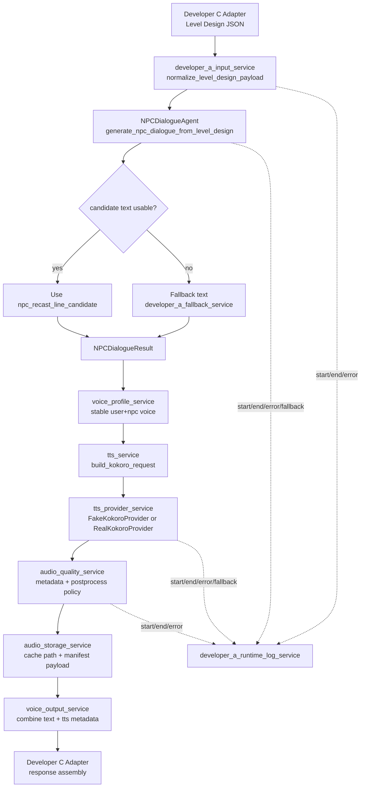

# NPC Dialogue Kokoro TTS 구현 계획서

> **For agentic workers:** REQUIRED SUB-SKILL: Use superpowers:subagent-driven-development (recommended) or superpowers:executing-plans to implement this plan task-by-task. Steps use checkbox (`- [ ]`) syntax for tracking.

**목표:** Developer A 소유 범위 안에서 Level Design Agent JSON을 받아 Officer Miller NPC 대사와 Kokoro 기반 TTS 요청/음성 metadata를 생성하는 1차 구현을 만든다.

**아키텍처:** 1차 구현은 Developer A 소유 파일인 `backend/app/agents`, `backend/app/services`, `backend/app/prompts` 안에서만 진행한다. middleware, tools, backend test 디렉터리, 실제 Kokoro dependency 추가는 소유권과 계약 합의가 필요하므로 Change Request로 분리한다. Kokoro는 기본 provider로 유지하되 `TTSProvider` interface와 `provider_options`를 준비해 F5-TTS, IndexTTS2, CosyVoice2 같은 후속 모델로 교체 가능하게 한다.

**기술 스택:** Python 3.12, uv, dataclasses, pydantic 사용 가능성 검토, fake Kokoro provider, optional real Kokoro provider, wav metadata, JSON metadata.

---

## 1. 소유권 기준

Developer A가 1차로 수정 가능한 파일:

- `backend/app/agents/npc_dialogue_agent.py`
- `backend/app/services/tts_service.py`
- `backend/app/services/voice_output_service.py`
- `backend/app/prompts/npc_dialogue_prompt.md`

Developer A가 새로 만들 파일:

- `backend/app/services/tts_provider_service.py`
- `backend/app/services/voice_profile_service.py`
- `backend/app/services/audio_storage_service.py`
- `backend/app/services/audio_quality_service.py`
- `backend/app/services/developer_a_runtime_log_service.py`
- `backend/app/services/developer_a_fallback_service.py`
- `backend/app/services/developer_a_input_service.py`

이번 구현에서 직접 만들지 않는 파일/경로:

- `backend/tests/`: Developer C 소유. 테스트 추가는 Change Request 필요.
- `backend/app/middleware/`: AGENTS에 Developer A 소유로 명시되지 않음. 1차에서는 service 함수로 대체.
- `backend/app/tools/`: AGENTS에 Developer A 소유로 명시되지 않음. 1차에서는 service/provider class로 대체.
- `backend/app/schemas/`: Developer C 소유. 사용하지 않음.
- `docs/handoff.md`: Developer C 소유. 필요한 내용은 Change Request에 먼저 기록.
- `docs/contracts/dependency_contract.md`: shared/Developer C 계약 문서. dependency 변경 전 Change Request 필요.

Change Request 작성 대상:

- `backend/tests/`에 Developer A 테스트 파일을 만들 수 있는지.
- 실제 Kokoro dependency(`kokoro`, `soundfile`, `torch`, Windows espeak 관련 package)를 추가해도 되는지.
- Developer C adapter가 받을 Developer A output field 확정.
- runtime audio 파일을 Developer C가 어떻게 URL로 서빙할지.

## 2. 입력 데이터 기준

Level Design Agent sample JSON에서 Developer A가 사용하는 필드:

```json
{
  "node_id": "IMM_002_PURPOSE",
  "player_text": "I here tourism.",
  "node_context": {
    "npc_question": "What is the purpose of your visit?",
    "recommended_expression": "I'm here for tourism.",
    "next_question_goal": "ask_stay_duration"
  },
  "evaluation_summary": {
    "verdict": "SUCCESS",
    "task_success": 3,
    "clarity": 2,
    "main_feedback_tag": "minor_grammar_issue",
    "feedback_note": "방문 목적은 전달됐지만 완전한 문장으로 말하면 더 자연스럽습니다."
  },
  "level_hint": {
    "english_level": "beginner",
    "needs_hint": false,
    "recommended_expression": "I'm here for tourism."
  },
  "in_game_feedback": {
    "show": true,
    "feedback_strategy": "recast",
    "priority": "low",
    "npc_recast_line_candidate": "You're here for tourism. How long will you stay?",
    "recommended_expression": "I'm here for tourism.",
    "blocks_progression": false
  },
  "branch": {
    "branch_type": "success",
    "next_action": "ADVANCE",
    "next_node_id": "IMM_003_DURATION"
  },
  "dialogue_directive": {
    "purpose": "continue_to_next_question",
    "tone_hint": "neutral",
    "target_slot": "stay_duration",
    "do_not_generate_npc_text": false
  }
}
```

Developer A가 읽기만 하는 필드:

- `branch.branch_type`
- `branch.next_node_id`
- `dialogue_directive.target_slot`
- `dialogue_directive.purpose`

Developer A가 변경하거나 새로 결정하지 않는 필드:

- branch
- next node
- Unreal command
- validation result
- scenario progression
- score

## 3. 출력 데이터 기준

1차 Developer A 내부 결과:

```json
{
  "speaker": "Officer Miller",
  "npc_text": "You're here for tourism. How long will you stay?",
  "feedback_kr": "방문 목적은 전달됐습니다. 더 자연스럽게는: I'm here for tourism.",
  "tone": "formal_neutral",
  "animation": "officer_check_passport",
  "tts": {
    "provider": "kokoro",
    "voice_id": "am_michael",
    "voice_profile_id": "user_001:officer_miller",
    "status": "ok",
    "audio_path": "backend/runtime/audio/kokoro/<cache_key>.wav",
    "audio_url": null,
    "sample_rate": 24000,
    "format": "wav",
    "quality_metadata": {
      "sample_rate": 24000,
      "channels": 1,
      "duration_ms": 3675,
      "silent_ratio": 0.45
    },
    "postprocess_policy": {
      "target_sample_rate": 24000,
      "target_format": "wav",
      "target_channels": 1,
      "target_peak_dbfs": -3.0,
      "trim_outer_silence": true,
      "preserve_sentence_pause": true
    }
  },
  "fallback": {
    "used": false,
    "reason": null
  }
}
```

주의:

- `audio_url`은 Developer C 서빙 정책이 확정될 때까지 `null` 가능.
- 1차 fake provider는 실제 wav처럼 분석 가능한 최소 유효 wav를 만든다.
- 실제 Kokoro provider는 dependency Change Request 승인 후 연결한다.

## 4. TTS 모델 선정 기준

샘플 wav 분석 결과:

| 모델 | sample rate | 길이 | 평균 음량 | 무음 비율 | 판단 |
|---|---:|---:|---:|---:|---|
| Kitten | 24000Hz | 3.05s | -18.8 dBFS | 23.5% | 깔끔하지만 뒤 여백이 없어 NPC 호흡이 짧게 느껴질 수 있음 |
| ChatTTS | 24000Hz | 2.89s | -19.6 dBFS | 31.7% | 앞 무음이 길고 실제 발화가 짧게 압축되어 게임 응답에서 지연처럼 느껴질 수 있음 |
| Parler | 44100Hz | 3.34s | -15.6 dBFS | 11.3% | 감정 표현 가능성은 있으나 말이 조밀하고 음량이 커서 공식 질문 톤보다 연기 톤으로 들릴 수 있음 |
| Kokoro | 24000Hz | 3.68s | -27.4 dBFS | 45.7% | 음량은 낮지만 호흡과 여백이 있어 Officer Miller 톤에 가장 가까움 |

선정 기준:

- 1차 provider는 `kokoro`.
- emotion tag보다 prosody, latency, 발음 안정성, Officer Miller 상황 적합성을 우선.
- Kokoro의 emotion 한계는 `voice`, `speed`, 문장 길이, punctuation, pause로 보완.
- 실제 audio normalization은 2차. 1차는 metadata와 policy만 기록.

## 5. Agent 구조



## 6. 구현 Task

### Task 1: Change Request 작성

**Files:**
- Modify: `docs/contracts/change_requests.md`

- [ ] **Step 1: Change Request 추가**

다음 내용을 append한다.

```markdown
## Change Request - Developer A NPC Dialogue/TTS Implementation

- Requested by: Developer A
- Date: 2026-06-03
- Scope: NPC dialogue and TTS provider implementation

### Requests

1. Allow Developer A to add focused tests for Developer A owned services.
   - Proposed location: `backend/tests/developer_a/`
   - Reason: `backend/tests/` is currently Developer C owned, but Developer A needs isolated verification for dialogue/TTS services.

2. Approve Kokoro runtime dependencies after fake provider is verified.
   - Proposed dependencies: `kokoro`, `soundfile`, `torch`, Windows espeak runtime helper packages if required.
   - Reason: real wav generation requires these dependencies, but dependency contract must be updated first.

3. Confirm Developer A output fields consumed by Developer C adapter.
   - Proposed fields: `speaker`, `npc_text`, `feedback_kr`, `tone`, `animation`, `tts`, `fallback`.

4. Confirm runtime audio serving policy.
   - Proposed local path: `backend/runtime/audio/kokoro/<cache_key>.wav`
   - Proposed URL field: `audio_url`, nullable until Developer C static serving is ready.
```

### Task 2: 입력 정규화 service

**Files:**
- Create: `backend/app/services/developer_a_input_service.py`

- [ ] **Step 1: 구현**

```python
from typing import Any


def normalize_level_design_payload(payload: dict[str, Any]) -> dict[str, Any]:
    node_context = payload.get("node_context") or {}
    evaluation_summary = payload.get("evaluation_summary") or {}
    level_hint = payload.get("level_hint") or {}
    in_game_feedback = payload.get("in_game_feedback") or {}
    branch = payload.get("branch") or {}
    dialogue_directive = payload.get("dialogue_directive") or {}

    return {
        "node_id": payload.get("node_id", ""),
        "player_text": payload.get("player_text", ""),
        "npc_question": node_context.get("npc_question", ""),
        "recommended_expression": (
            in_game_feedback.get("recommended_expression")
            or level_hint.get("recommended_expression")
            or node_context.get("recommended_expression")
            or ""
        ),
        "english_level": level_hint.get("english_level", "beginner"),
        "feedback_note": evaluation_summary.get("feedback_note", ""),
        "feedback_tag": evaluation_summary.get("main_feedback_tag", ""),
        "candidate_text": in_game_feedback.get("npc_recast_line_candidate", ""),
        "feedback_strategy": in_game_feedback.get("feedback_strategy", ""),
        "blocks_progression": bool(in_game_feedback.get("blocks_progression", False)),
        "branch_type": branch.get("branch_type", ""),
        "next_node_id": branch.get("next_node_id", ""),
        "dialogue_purpose": dialogue_directive.get("purpose", ""),
        "tone_hint": dialogue_directive.get("tone_hint", "neutral"),
        "target_slot": dialogue_directive.get("target_slot", ""),
        "do_not_generate_npc_text": bool(dialogue_directive.get("do_not_generate_npc_text", False)),
    }
```

### Task 3: fallback service

**Files:**
- Create: `backend/app/services/developer_a_fallback_service.py`

- [ ] **Step 1: 구현**

```python
from typing import Any


def build_text_fallback(normalized: dict[str, Any]) -> dict[str, Any]:
    target_slot = normalized.get("target_slot")
    if target_slot == "stay_duration":
        text = "Okay. How long will you stay?"
    else:
        text = "Okay. Please continue."

    return {
        "speaker": "Officer Miller",
        "npc_text": text,
        "feedback_kr": normalized.get("feedback_note") or "의미는 전달됐습니다. 조금 더 자연스럽게 말해 봅시다.",
        "tone": "formal_neutral",
        "animation": "officer_check_passport",
        "fallback": {
            "used": True,
            "reason": "missing_or_blocked_candidate_text",
            "branch_type": normalized.get("branch_type"),
            "next_node_id": normalized.get("next_node_id"),
        },
    }


def build_audio_fallback(provider: str, voice_id: str, reason: str) -> dict[str, Any]:
    return {
        "provider": provider,
        "voice_id": voice_id,
        "audio_path": None,
        "audio_url": None,
        "sample_rate": None,
        "format": "wav",
        "status": "failed",
        "fallback": {"used": True, "reason": reason},
    }
```

### Task 4: NPC Dialogue Agent

**Files:**
- Modify: `backend/app/agents/npc_dialogue_agent.py`

- [ ] **Step 1: 구현**

```python
from typing import Any

from backend.app.services.developer_a_fallback_service import build_text_fallback
from backend.app.services.developer_a_input_service import normalize_level_design_payload


def generate_npc_dialogue_from_level_design(payload: dict[str, Any]) -> dict[str, Any]:
    normalized = normalize_level_design_payload(payload)
    if normalized["do_not_generate_npc_text"] or normalized["blocks_progression"]:
        return build_text_fallback(normalized)

    candidate_text = normalized.get("candidate_text", "").strip()
    if not candidate_text:
        return build_text_fallback(normalized)

    recommended = normalized.get("recommended_expression", "")
    feedback_note = normalized.get("feedback_note", "")
    feedback_kr = feedback_note
    if recommended:
        feedback_kr = f"{feedback_note} 더 자연스럽게는: {recommended}".strip()

    return {
        "speaker": "Officer Miller",
        "npc_text": candidate_text,
        "feedback_kr": feedback_kr,
        "tone": _map_tone(normalized.get("tone_hint", "neutral")),
        "animation": "officer_check_passport",
        "fallback": {"used": False, "reason": None},
    }


def _map_tone(tone_hint: str) -> str:
    if tone_hint == "firm":
        return "formal_firm"
    if tone_hint in {"supportive", "encouraging"}:
        return "formal_supportive"
    return "formal_neutral"
```

### Task 5: TTS provider interface

**Files:**
- Create: `backend/app/services/tts_provider_service.py`

- [ ] **Step 1: 구현**

```python
from dataclasses import dataclass, field
from pathlib import Path
from typing import Any, Protocol
import math
import struct
import wave


@dataclass(frozen=True)
class TTSCapabilities:
    supports_emotion_prompt: bool
    supports_voice_clone: bool
    supports_speed: bool
    supports_pitch: bool
    output_sample_rates: tuple[int, ...]


KOKORO_CAPABILITIES = TTSCapabilities(
    supports_emotion_prompt=False,
    supports_voice_clone=False,
    supports_speed=True,
    supports_pitch=False,
    output_sample_rates=(24000,),
)


@dataclass(frozen=True)
class TTSProviderRequest:
    provider: str
    text: str
    speaker_id: str
    voice_profile_id: str
    language: str
    emotion: str
    tone: str
    intensity: float
    speaking_rate: float
    pitch: float
    sample_rate: int
    output_format: str
    provider_options: dict[str, Any] = field(default_factory=dict)


class TTSProvider(Protocol):
    provider_name: str
    capabilities: TTSCapabilities

    def synthesize(self, request: TTSProviderRequest, output_path: Path) -> dict[str, Any]:
        ...


class FakeKokoroProvider:
    provider_name = "kokoro"
    capabilities = KOKORO_CAPABILITIES

    def synthesize(self, request: TTSProviderRequest, output_path: Path) -> dict[str, Any]:
        output_path.parent.mkdir(parents=True, exist_ok=True)
        _write_valid_fake_wav(output_path, sample_rate=request.sample_rate, seconds=1.0)
        return {
            "provider": self.provider_name,
            "voice_id": request.provider_options.get("voice", "am_michael"),
            "audio_path": str(output_path),
            "audio_url": None,
            "sample_rate": request.sample_rate,
            "format": request.output_format,
            "status": "ok",
        }


def _write_valid_fake_wav(path: Path, sample_rate: int, seconds: float) -> None:
    frame_count = int(sample_rate * seconds)
    amplitude = 1200
    frequency = 220.0
    with wave.open(str(path), "wb") as wav:
        wav.setnchannels(1)
        wav.setsampwidth(2)
        wav.setframerate(sample_rate)
        for index in range(frame_count):
            value = int(amplitude * math.sin(2 * math.pi * frequency * index / sample_rate))
            wav.writeframes(struct.pack("<h", value))
```

### Task 6: TTS request mapper

**Files:**
- Modify: `backend/app/services/tts_service.py`

- [ ] **Step 1: 구현**

```python
from dataclasses import dataclass
from typing import Any, Literal

from backend.app.services.tts_provider_service import TTSProviderRequest

TTSStatus = Literal["ok", "failed", "fallback_mock"]


@dataclass(frozen=True)
class TTSAudio:
    provider: str
    audio_url: str | None
    voice_id: str
    duration_ms: int
    audio_path: str | None = None
    sample_rate: int | None = None
    status: TTSStatus = "ok"
    fallback: dict[str, Any] | None = None


def build_kokoro_provider_request(
    text: str,
    speaker_id: str,
    voice_profile_id: str,
    kokoro_voice: str,
    tone: str,
    english_level: str,
) -> TTSProviderRequest:
    speed = _kokoro_speed(tone=tone, english_level=english_level)
    return TTSProviderRequest(
        provider="kokoro",
        text=text,
        speaker_id=speaker_id,
        voice_profile_id=voice_profile_id,
        language="en",
        emotion=_emotion_for_tone(tone),
        tone=tone,
        intensity=0.35,
        speaking_rate=speed,
        pitch=0.0,
        sample_rate=24000,
        output_format="wav",
        provider_options={"voice": kokoro_voice, "lang_code": "a"},
    )


def _kokoro_speed(tone: str, english_level: str) -> float:
    if tone == "formal_firm":
        return 0.9
    if tone == "formal_supportive":
        return 0.92
    if english_level == "beginner":
        return 0.95
    return 1.0


def _emotion_for_tone(tone: str) -> str:
    if tone == "formal_firm":
        return "firm_official"
    if tone == "formal_supportive":
        return "supportive_official"
    return "calm_official"
```

### Task 7: Voice profile service

**Files:**
- Create: `backend/app/services/voice_profile_service.py`

- [ ] **Step 1: 구현**

```python
from dataclasses import dataclass
import hashlib


@dataclass(frozen=True)
class VoiceProfile:
    user_id: str
    npc_id: str
    voice_profile_id: str
    provider: str
    voice_id: str


def resolve_voice_profile(user_id: str, npc_id: str) -> VoiceProfile:
    safe_user_id = user_id or "user_unknown"
    safe_npc_id = npc_id or "officer_miller"
    digest = hashlib.sha256(f"{safe_user_id}:{safe_npc_id}".encode("utf-8")).hexdigest()[:12]
    return VoiceProfile(
        user_id=safe_user_id,
        npc_id=safe_npc_id,
        voice_profile_id=f"{safe_user_id}:{safe_npc_id}",
        provider="kokoro",
        voice_id=_select_officer_miller_voice(digest),
    )


def _select_officer_miller_voice(digest: str) -> str:
    voices = ("am_michael",)
    index = int(digest[:4], 16) % len(voices)
    return voices[index]
```

### Task 8: Audio storage service

**Files:**
- Create: `backend/app/services/audio_storage_service.py`

- [ ] **Step 1: 구현**

```python
from pathlib import Path
import hashlib


def build_audio_cache_key(
    text: str,
    voice: str,
    speed: float,
    sample_rate: int,
    output_format: str,
    model_version: str,
) -> str:
    raw = "|".join([text, voice, f"{speed:.3f}", str(sample_rate), output_format, model_version])
    return hashlib.sha256(raw.encode("utf-8")).hexdigest()


def audio_output_path(root: Path, cache_key: str, output_format: str) -> Path:
    return root / "audio" / "kokoro" / f"{cache_key}.{output_format}"
```

### Task 9: Audio quality service

**Files:**
- Create: `backend/app/services/audio_quality_service.py`

- [ ] **Step 1: 구현**

```python
from pathlib import Path
from typing import Any
import audioop
import wave


def analyze_wav_quality(path: Path) -> dict[str, Any]:
    with wave.open(str(path), "rb") as wav:
        channels = wav.getnchannels()
        sample_width = wav.getsampwidth()
        sample_rate = wav.getframerate()
        frame_count = wav.getnframes()
        data = wav.readframes(frame_count)

    duration_ms = int(frame_count / sample_rate * 1000)
    maxamp = (2 ** (8 * sample_width - 1)) - 1
    window = max(1, int(sample_rate * 0.02))
    threshold = maxamp * 0.01
    silent_windows = 0
    total_windows = 0

    for start in range(0, frame_count, window):
        end = min(frame_count, start + window)
        chunk = data[start * channels * sample_width : end * channels * sample_width]
        if chunk:
            total_windows += 1
            if audioop.rms(chunk, sample_width) < threshold:
                silent_windows += 1

    return {
        "sample_rate": sample_rate,
        "channels": channels,
        "bit_depth": sample_width * 8,
        "duration_ms": duration_ms,
        "silent_ratio": silent_windows / total_windows if total_windows else 0.0,
    }


def build_postprocess_policy(provider: str) -> dict[str, Any]:
    return {
        "provider": provider,
        "target_sample_rate": 24000,
        "target_format": "wav",
        "target_channels": 1,
        "target_peak_dbfs": -3.0,
        "trim_outer_silence": True,
        "preserve_sentence_pause": True,
        "actual_dsp_applied": False,
    }
```

### Task 10: Runtime log service

**Files:**
- Create: `backend/app/services/developer_a_runtime_log_service.py`

- [ ] **Step 1: 구현**

```python
from datetime import UTC, datetime
from pathlib import Path
from typing import Any
import json
import uuid

PRIVATE_KEYS = {"player_text"}


def write_developer_a_event(
    log_path: Path,
    component_name: str,
    event: str,
    status: str,
    request_id: str | None = None,
    session_id: str | None = None,
    metadata: dict[str, Any] | None = None,
) -> None:
    safe_metadata = {
        key: value for key, value in (metadata or {}).items() if key not in PRIVATE_KEYS
    }
    entry = {
        "event_id": f"evt_{uuid.uuid4().hex}",
        "request_id": request_id or f"req_{uuid.uuid4().hex}",
        "session_id": session_id or "session_unknown",
        "component_name": component_name,
        "event": event,
        "status": status,
        "metadata": safe_metadata,
        "created_at": datetime.now(UTC).isoformat(),
    }
    log_path.parent.mkdir(parents=True, exist_ok=True)
    with log_path.open("a", encoding="utf-8") as file:
        file.write(json.dumps(entry, ensure_ascii=False) + "\n")
```

### Task 11: Voice output service

**Files:**
- Modify: `backend/app/services/voice_output_service.py`

- [ ] **Step 1: 구현**

```python
from pathlib import Path
from typing import Any

from backend.app.services.audio_quality_service import analyze_wav_quality, build_postprocess_policy
from backend.app.services.audio_storage_service import audio_output_path, build_audio_cache_key
from backend.app.services.tts_provider_service import FakeKokoroProvider


def build_voice_output(
    dialogue: dict[str, Any],
    tts_request: Any,
    runtime_root: Path,
    model_version: str = "fake-kokoro-v1",
) -> dict[str, Any]:
    voice = tts_request.provider_options["voice"]
    cache_key = build_audio_cache_key(
        text=tts_request.text,
        voice=voice,
        speed=tts_request.speaking_rate,
        sample_rate=tts_request.sample_rate,
        output_format=tts_request.output_format,
        model_version=model_version,
    )
    output_path = audio_output_path(runtime_root, cache_key, tts_request.output_format)
    metadata = FakeKokoroProvider().synthesize(tts_request, output_path)
    quality_metadata = analyze_wav_quality(output_path)

    return {
        **dialogue,
        "tts": {
            **metadata,
            "cache_key": cache_key,
            "quality_metadata": quality_metadata,
            "postprocess_policy": build_postprocess_policy(provider=metadata["provider"]),
        },
    }
```

### Task 12: Manual smoke verification

**Files:**
- No new files

- [ ] **Step 1: import 검증**

```powershell
uv run python -c "from backend.app.agents.npc_dialogue_agent import generate_npc_dialogue_from_level_design; from backend.app.services.tts_provider_service import FakeKokoroProvider; print('ok')"
```

예상:

```text
ok
```

- [ ] **Step 2: 전체 lint**

```powershell
uv run ruff check backend/app/agents/npc_dialogue_agent.py backend/app/services/tts_service.py backend/app/services/voice_output_service.py backend/app/services/tts_provider_service.py backend/app/services/voice_profile_service.py backend/app/services/audio_storage_service.py backend/app/services/audio_quality_service.py backend/app/services/developer_a_runtime_log_service.py backend/app/services/developer_a_fallback_service.py backend/app/services/developer_a_input_service.py
```

예상: PASS.

- [ ] **Step 3: 기존 테스트만 실행**

```powershell
uv run pytest
```

예상: 기존 테스트 PASS. Developer A 신규 테스트는 Change Request 승인 전까지 만들지 않는다.

## 7. 구현 순서

1. Change Request 작성.
2. `developer_a_input_service.py` 구현.
3. `developer_a_fallback_service.py` 구현.
4. `npc_dialogue_agent.py`를 Level Design JSON 기반으로 확장.
5. `tts_provider_service.py`에 provider interface와 fake Kokoro provider 구현.
6. `tts_service.py`에 Kokoro request mapper 구현.
7. `voice_profile_service.py` 구현.
8. `audio_storage_service.py` 구현.
9. `audio_quality_service.py` 구현.
10. `developer_a_runtime_log_service.py` 구현.
11. `voice_output_service.py`에서 dialogue + fake wav metadata 결합.
12. import, ruff, 기존 pytest로 검증.

## 8. 남은 합의 사항

- Developer A 테스트 파일 위치.
- 실제 Kokoro dependency 추가 시점.
- Developer C adapter input/output field.
- runtime audio URL 서빙 정책.
- 실제 loudness normalization/resampling/silence trim 도입 여부.

## 9. 구현 판단

이 계획대로면 Developer A 소유 범위 안에서 1차 구현을 진행할 수 있다. 다만 실제 Kokoro 모델 호출, backend test 추가, middleware/tool 분리는 계약 합의 후 2차로 진행한다.
