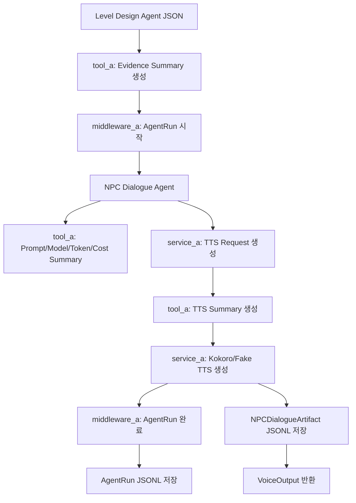

# NPC Dialogue AgentRun Logging Implementation Plan

> **For agentic workers:** REQUIRED SUB-SKILL: Use superpowers:executing-plans to implement this plan task-by-task. Steps use checkbox (`- [ ]`) syntax for tracking.

**Goal:** NPC Dialogue Agent 실행 기록을 Slack Agent의 `AgentRun` 방식처럼 구조화해, 사용자가 “어떤 입력 근거를 보고, 어떤 프롬프트/모델/도구를 써서, 어떤 대사와 TTS 결과가 나왔는지”를 표 형태로 설명할 수 있게 만든다.

**Architecture:** Developer A 전용 tool/middleware만 사용한다. `middleware_a`가 실행 1회당 `AgentRun` 구조를 생성하고, `tool_a`가 Level Design JSON, dialogue result, TTS result를 짧은 evidence/artifact summary로 변환한다. 실제 DB 테이블이 아직 없으므로 1차 구현은 Developer A runtime JSONL 파일을 “AgentRun table-like store”로 사용하고, 공용 DB 연동은 Change Request로 분리한다.

**Tech Stack:** Python 3.12, dataclasses, pathlib, json, hashlib, datetime, 기존 Developer A `agent_a/service_a` 구조, uv.

---

## 1. 요구사항 해석

Slack Agent 로그 방식의 핵심은 텍스트 로그가 아니라 **실행 1회 = AgentRun 레코드 1개**로 저장하는 것이다.

NPC Dialogue Agent도 같은 구조로 맞춘다.

```text
Level Design JSON / Player Input / NPC Context
        ↓
NPCDialogueEvidencePacket
        ↓
NPC Dialogue Agent 실행
        ↓
AgentRun 저장
        ↓
NPCDialogueArtifact 저장
  - agent_run_id로 AgentRun과 연결
  - npc_text, tts_text, audio_url, fallback 여부 보존
```

단, 현재 프로젝트에는 실제 DB나 공용 `AgentRun` model이 없으므로 1차 구현은 아래 두 파일로 남긴다.

```text
backend/runtime/agent_runs/npc_dialogue_agent_runs.jsonl
backend/runtime/agent_runs/npc_dialogue_artifacts.jsonl
```

나중에 Developer C가 DB 기반 `AgentRun` 테이블을 만들면, Developer A store만 adapter로 교체한다.

## 2. 소유권 원칙

모든 tool과 middleware는 각 agent 내부에서만 사용하기로 합의했다.

Developer A는 아래 경로만 사용한다.

```text
backend/app/tools/tool_a/
backend/app/middleware/middleware_a/
backend/app/agents/agent_a/
backend/app/services/service_a/
```

수정하지 않는 영역:

```text
backend/app/tools/tool_b/
backend/app/tools/tool_c/
backend/app/middleware/middleware_b/
backend/app/middleware/middleware_c/
backend/app/services/service_c/orchestrator.py
backend/app/schemas/
```

공용 DB/계약이 필요하면 `docs/contracts/change_requests.md`에 요청만 남긴다.

## 3. 사용자가 보게 될 AgentRun 레코드

1차 구현의 AgentRun JSONL 한 줄은 아래 형태다.

```json
{
  "agent_run_id": "npcdlg_run_20260604_000000_8f1c2a9b",
  "agent_name": "npc_dialogue_agent",
  "prompt_version": "npc_dialogue_prompt_v1",
  "status": "completed",
  "source_window": {
    "source_type": "level_design_json",
    "node_id": "IMM_003_DURATION",
    "turn_id": "turn_003",
    "chapter_id": "chapter_0_immigration"
  },
  "cache_key": "sha256:2e51...",
  "model_name": "gpt-4o-mini",
  "input_tokens": 812,
  "output_tokens": 96,
  "total_tokens": 908,
  "estimated_cost_usd": 0.00014,
  "permission_level": "runtime_user_session",
  "metadata": {
    "source_type": "level_design",
    "cache_hit": false,
    "selection_strategy": "single_turn_level_design_payload",
    "evidence_summary": [
      {
        "rank": 1,
        "source_id": "IMM_003_DURATION:turn_003",
        "source_url": null,
        "timestamp": "2026-06-04T00:00:00+09:00",
        "author": "level_design_agent",
        "permission_level": "runtime_user_session",
        "importance_score": 100,
        "snippet": "Player answered: I will stay five days. Branch: success. Target slot: stay_address."
      }
    ],
    "npc_context": {
      "npc_id": "officer_miller",
      "npc_emotion": "neutral",
      "tone": "formal_supportive"
    },
    "tts_summary": {
      "provider": "kokoro",
      "voice_id": "am_michael",
      "speed": 0.92,
      "lang_code": "a",
      "audio_url": "http://localhost:8000/runtime/audio/kokoro/IMM_003_DURATION_stay_address_success_am_michael_02160baf.wav"
    },
    "fallback": {
      "used": false,
      "reason": null
    }
  },
  "created_at": "2026-06-04T00:00:00+09:00",
  "completed_at": "2026-06-04T00:00:03+09:00"
}
```

Artifact JSONL 한 줄은 아래 형태다.

```json
{
  "artifact_id": "npcdlg_artifact_20260604_000000_3b12aa91",
  "agent_run_id": "npcdlg_run_20260604_000000_8f1c2a9b",
  "artifact_type": "npc_dialogue_voice_output",
  "status": "ready",
  "payload": {
    "npc_id": "officer_miller",
    "npc_text": "Alright. You'll stay for five days. Where will you be staying?",
    "tts_text": "Alright. You'll stay for five days. ... Where will you be staying?",
    "feedback_kr": "기간 답변은 의미가 전달됐지만 'for five days'가 더 자연스럽습니다.",
    "audio_url": "http://localhost:8000/runtime/audio/kokoro/IMM_003_DURATION_stay_address_success_am_michael_02160baf.wav",
    "audio_path": "backend/runtime/audio/kokoro/IMM_003_DURATION_stay_address_success_am_michael_02160baf.wav"
  },
  "source_links": [
    {
      "source_type": "level_design_json",
      "source_id": "IMM_003_DURATION:turn_003"
    }
  ],
  "source_snippets": [
    "Player answered: I will stay five days. Branch: success. Target slot: stay_address."
  ],
  "created_at": "2026-06-04T00:00:03+09:00"
}
```

## 4. 사용자 설명용 Mermaid 구조



## 5. 생성/수정 파일

```text
Create:
  backend/app/tools/tool_a/npc_dialogue_evidence_tool.py
  backend/app/tools/tool_a/npc_dialogue_cost_tool.py
  backend/app/tools/tool_a/npc_dialogue_artifact_tool.py
  backend/app/middleware/middleware_a/npc_dialogue_agent_run_middleware.py
  backend/app/services/service_a/npc_dialogue_agent_run_store.py
  backend/tests/test_developer_a_agent_run_logging.py

Modify:
  backend/app/services/service_a/voice_output_service.py
  backend/app/agents/agent_a/npc_dialogue_agent.py
  backend/app/agents/agent_a/npc_llm_client.py
  AGENTS.md
  docs/contracts/change_requests.md
  docs/implementation_logs/developer_a_implementation_log_kimyonghee.md
```

## 6. Task 1: Evidence Summary Tool 구현

**Files:**
- Create: `backend/app/tools/tool_a/npc_dialogue_evidence_tool.py`
- Test: `backend/tests/test_developer_a_agent_run_logging.py`

- [ ] **Step 1: 실패 테스트 작성**

```python
from backend.app.tools.tool_a.npc_dialogue_evidence_tool import (
    build_npc_dialogue_evidence_summary,
)


def test_build_npc_dialogue_evidence_summary_uses_short_traceable_snippet() -> None:
    payload = {
        "chapter_id": "chapter_0_immigration",
        "turn_id": "turn_003",
        "node_id": "IMM_003_DURATION",
        "npc": {"npc_id": "officer_miller", "emotion": "neutral"},
        "player": {"utterance": "I will stay five days", "language_level": "beginner"},
        "evaluation": {"branch_type": "success", "target_slot": "stay_address"},
    }

    summary = build_npc_dialogue_evidence_summary(payload)

    assert summary["source_type"] == "level_design"
    assert summary["selection_strategy"] == "single_turn_level_design_payload"
    assert summary["evidence_summary"][0]["source_id"] == "IMM_003_DURATION:turn_003"
    assert summary["evidence_summary"][0]["author"] == "level_design_agent"
    assert summary["evidence_summary"][0]["importance_score"] == 100
    assert summary["evidence_summary"][0]["snippet"] == (
        "Player answered: I will stay five days. Branch: success. Target slot: stay_address."
    )
```

- [ ] **Step 2: 실패 확인**

```powershell
$env:UV_CACHE_DIR='C:\5th_project\pj05_Murphy\.tmp\uv-cache'; uv run pytest backend/tests/test_developer_a_agent_run_logging.py::test_build_npc_dialogue_evidence_summary_uses_short_traceable_snippet -q
```

Expected:

```text
ModuleNotFoundError
```

- [ ] **Step 3: 구현**

```python
from datetime import UTC, datetime
from typing import Any


def _as_dict(value: Any) -> dict[str, Any]:
    return value if isinstance(value, dict) else {}


def _text(value: Any, default: str = "") -> str:
    return value.strip() if isinstance(value, str) and value.strip() else default


def build_npc_dialogue_evidence_summary(payload: dict[str, Any]) -> dict[str, Any]:
    # 원문 전체가 아니라 AgentRun에서 추적 가능한 짧은 근거 요약만 저장한다.
    player = _as_dict(payload.get("player"))
    evaluation = _as_dict(payload.get("evaluation"))
    node_id = _text(payload.get("node_id"), "unknown_node")
    turn_id = _text(payload.get("turn_id"), "unknown_turn")
    player_text = _text(player.get("utterance"), _text(payload.get("player_text"), ""))
    branch_type = _text(evaluation.get("branch_type"), _text(payload.get("branch_type"), "neutral"))
    target_slot = _text(evaluation.get("target_slot"), _text(payload.get("target_slot"), "unknown_slot"))

    return {
        "source_type": "level_design",
        "cache_hit": False,
        "selection_strategy": "single_turn_level_design_payload",
        "evidence_summary": [
            {
                "rank": 1,
                "source_id": f"{node_id}:{turn_id}",
                "source_url": None,
                "timestamp": datetime.now(UTC).isoformat(),
                "author": "level_design_agent",
                "permission_level": "runtime_user_session",
                "channel_id": None,
                "importance_score": 100,
                "snippet": (
                    f"Player answered: {player_text}. "
                    f"Branch: {branch_type}. Target slot: {target_slot}."
                ),
            }
        ],
    }
```

## 7. Task 2: Token/Cost Tool 구현

**Files:**
- Create: `backend/app/tools/tool_a/npc_dialogue_cost_tool.py`
- Modify: `backend/app/agents/agent_a/npc_llm_client.py`
- Test: `backend/tests/test_developer_a_agent_run_logging.py`

- [ ] **Step 1: 실패 테스트 작성**

```python
from backend.app.tools.tool_a.npc_dialogue_cost_tool import estimate_openai_cost_usd


def test_estimate_openai_cost_usd_for_gpt_4o_mini() -> None:
    cost = estimate_openai_cost_usd(
        model_name="gpt-4o-mini",
        input_tokens=1000,
        output_tokens=500,
    )

    assert cost == 0.000225
```

- [ ] **Step 2: 구현**

```python
GPT_4O_MINI_INPUT_PER_1M = 0.15
GPT_4O_MINI_OUTPUT_PER_1M = 0.30


def estimate_openai_cost_usd(
    *,
    model_name: str,
    input_tokens: int,
    output_tokens: int,
) -> float:
    # 비용은 운영 추적용 추정값이다. 실제 청구 비용과 차이가 날 수 있다.
    if model_name != "gpt-4o-mini":
        return 0.0
    input_cost = input_tokens / 1_000_000 * GPT_4O_MINI_INPUT_PER_1M
    output_cost = output_tokens / 1_000_000 * GPT_4O_MINI_OUTPUT_PER_1M
    return round(input_cost + output_cost, 8)
```

- [ ] **Step 3: LLM client token usage 반환 필드 점검**

`backend/app/agents/agent_a/npc_llm_client.py`의 LLM result metadata에 아래 값이 들어가도록 계획한다.

```python
{
    "model_name": self.model,
    "input_tokens": input_tokens,
    "output_tokens": output_tokens,
    "total_tokens": input_tokens + output_tokens,
}
```

OpenAI response에 usage가 없으면 모두 `0`으로 둔다.

## 8. Task 3: AgentRun Middleware 구현

**Files:**
- Create: `backend/app/middleware/middleware_a/npc_dialogue_agent_run_middleware.py`
- Test: `backend/tests/test_developer_a_agent_run_logging.py`

- [ ] **Step 1: 실패 테스트 작성**

```python
from backend.app.middleware.middleware_a.npc_dialogue_agent_run_middleware import (
    NPCDialogueAgentRunMiddleware,
)


def test_agent_run_middleware_builds_slack_style_agent_run() -> None:
    middleware = NPCDialogueAgentRunMiddleware()

    run = middleware.start_run(
        prompt_version="npc_dialogue_prompt_v1",
        source_window={
            "source_type": "level_design_json",
            "node_id": "IMM_003_DURATION",
            "turn_id": "turn_003",
            "chapter_id": "chapter_0_immigration",
        },
        cache_key="sha256:test",
        model_name="gpt-4o-mini",
        permission_level="runtime_user_session",
        metadata={"source_type": "level_design", "evidence_summary": []},
    )
    completed = middleware.complete_run(
        run,
        input_tokens=100,
        output_tokens=20,
        estimated_cost_usd=0.000021,
    )

    assert completed["agent_name"] == "npc_dialogue_agent"
    assert completed["status"] == "completed"
    assert completed["total_tokens"] == 120
    assert completed["estimated_cost_usd"] == 0.000021
```

- [ ] **Step 2: 구현**

```python
from datetime import UTC, datetime
from hashlib import sha256
from typing import Any


class NPCDialogueAgentRunMiddleware:
    """NPC Dialogue Agent 실행 1회를 Slack AgentRun과 유사한 구조로 조립한다."""

    def start_run(
        self,
        *,
        prompt_version: str,
        source_window: dict[str, Any],
        cache_key: str,
        model_name: str,
        permission_level: str,
        metadata: dict[str, Any],
    ) -> dict[str, Any]:
        now = datetime.now(UTC).isoformat()
        run_id_seed = f"{now}:{cache_key}:{model_name}".encode("utf-8")
        return {
            "agent_run_id": f"npcdlg_run_{sha256(run_id_seed).hexdigest()[:12]}",
            "agent_name": "npc_dialogue_agent",
            "prompt_version": prompt_version,
            "status": "running",
            "source_window": source_window,
            "cache_key": cache_key,
            "model_name": model_name,
            "input_tokens": 0,
            "output_tokens": 0,
            "total_tokens": 0,
            "estimated_cost_usd": 0.0,
            "permission_level": permission_level,
            "metadata": metadata,
            "created_at": now,
            "completed_at": None,
        }

    def complete_run(
        self,
        run: dict[str, Any],
        *,
        input_tokens: int,
        output_tokens: int,
        estimated_cost_usd: float,
    ) -> dict[str, Any]:
        run["status"] = "completed"
        run["input_tokens"] = input_tokens
        run["output_tokens"] = output_tokens
        run["total_tokens"] = input_tokens + output_tokens
        run["estimated_cost_usd"] = estimated_cost_usd
        run["completed_at"] = datetime.now(UTC).isoformat()
        return run

    def fail_run(self, run: dict[str, Any], *, error: str) -> dict[str, Any]:
        run["status"] = "failed"
        run["metadata"]["error"] = error
        run["completed_at"] = datetime.now(UTC).isoformat()
        return run
```

## 9. Task 4: AgentRun Store 구현

**Files:**
- Create: `backend/app/services/service_a/npc_dialogue_agent_run_store.py`
- Test: `backend/tests/test_developer_a_agent_run_logging.py`

- [ ] **Step 1: 실패 테스트 작성**

```python
import json

from backend.app.services.service_a.npc_dialogue_agent_run_store import (
    NPCDialogueAgentRunStore,
)


def test_agent_run_store_appends_run_and_artifact_jsonl(tmp_path) -> None:
    store = NPCDialogueAgentRunStore(root=tmp_path)
    run = {"agent_run_id": "run_1", "agent_name": "npc_dialogue_agent"}
    artifact = {"artifact_id": "artifact_1", "agent_run_id": "run_1"}

    run_path = store.append_agent_run(run)
    artifact_path = store.append_artifact(artifact)

    assert json.loads(run_path.read_text(encoding="utf-8").splitlines()[0]) == run
    assert json.loads(artifact_path.read_text(encoding="utf-8").splitlines()[0]) == artifact
```

- [ ] **Step 2: 구현**

```python
import json
from pathlib import Path
from typing import Any


class NPCDialogueAgentRunStore:
    """Developer A 전용 AgentRun table-like JSONL 저장소."""

    def __init__(self, root: Path) -> None:
        self.root = root

    def append_agent_run(self, run: dict[str, Any]) -> Path:
        path = self.root / "npc_dialogue_agent_runs.jsonl"
        self._append_jsonl(path, run)
        return path

    def append_artifact(self, artifact: dict[str, Any]) -> Path:
        path = self.root / "npc_dialogue_artifacts.jsonl"
        self._append_jsonl(path, artifact)
        return path

    def _append_jsonl(self, path: Path, payload: dict[str, Any]) -> None:
        path.parent.mkdir(parents=True, exist_ok=True)
        with path.open("a", encoding="utf-8") as file:
            file.write(json.dumps(payload, ensure_ascii=False) + "\n")
```

## 10. Task 5: Artifact Tool 구현

**Files:**
- Create: `backend/app/tools/tool_a/npc_dialogue_artifact_tool.py`
- Test: `backend/tests/test_developer_a_agent_run_logging.py`

- [ ] **Step 1: 실패 테스트 작성**

```python
from backend.app.tools.tool_a.npc_dialogue_artifact_tool import build_npc_dialogue_artifact


def test_build_npc_dialogue_artifact_links_to_agent_run() -> None:
    artifact = build_npc_dialogue_artifact(
        agent_run_id="run_1",
        npc_id="officer_miller",
        npc_text="Where will you be staying?",
        tts_text="Where will you be staying?",
        feedback_kr="좋습니다.",
        audio_url="http://localhost/audio.wav",
        audio_path="backend/runtime/audio.wav",
        source_id="IMM_003_DURATION:turn_003",
        source_snippet="Player answered: I will stay five days.",
    )

    assert artifact["agent_run_id"] == "run_1"
    assert artifact["artifact_type"] == "npc_dialogue_voice_output"
    assert artifact["payload"]["npc_text"] == "Where will you be staying?"
    assert artifact["source_links"][0]["source_id"] == "IMM_003_DURATION:turn_003"
```

- [ ] **Step 2: 구현**

```python
from datetime import UTC, datetime
from hashlib import sha256


def build_npc_dialogue_artifact(
    *,
    agent_run_id: str,
    npc_id: str,
    npc_text: str,
    tts_text: str,
    feedback_kr: str,
    audio_url: str | None,
    audio_path: str | None,
    source_id: str,
    source_snippet: str,
) -> dict[str, object]:
    now = datetime.now(UTC).isoformat()
    artifact_seed = f"{agent_run_id}:{npc_text}:{audio_url}".encode("utf-8")
    return {
        "artifact_id": f"npcdlg_artifact_{sha256(artifact_seed).hexdigest()[:12]}",
        "agent_run_id": agent_run_id,
        "artifact_type": "npc_dialogue_voice_output",
        "status": "ready",
        "payload": {
            "npc_id": npc_id,
            "npc_text": npc_text,
            "tts_text": tts_text,
            "feedback_kr": feedback_kr,
            "audio_url": audio_url,
            "audio_path": audio_path,
        },
        "source_links": [
            {
                "source_type": "level_design_json",
                "source_id": source_id,
            }
        ],
        "source_snippets": [source_snippet],
        "created_at": now,
    }
```

## 11. Task 6: Voice Output Pipeline에 AgentRun 연결

**Files:**
- Modify: `backend/app/services/service_a/voice_output_service.py`
- Test: `backend/tests/test_developer_a_agent_run_logging.py`

- [ ] **Step 1: 실패 테스트 작성**

```python
import json

from backend.app.services.service_a.voice_output_service import build_voice_output_from_level_design


def test_voice_output_writes_agent_run_and_artifact_records(tmp_path) -> None:
    payload = {
        "chapter_id": "chapter_0_immigration",
        "turn_id": "turn_003",
        "node_id": "IMM_003_DURATION",
        "npc": {"npc_id": "officer_miller", "emotion": "neutral"},
        "player": {"utterance": "I will stay five days", "language_level": "beginner"},
        "evaluation": {"branch_type": "success", "target_slot": "stay_address"},
    }

    output = build_voice_output_from_level_design(
        payload,
        use_llm_dialogue=False,
        use_real_tts=False,
        agent_run_root=tmp_path,
    )

    runs = [
        json.loads(line)
        for line in (tmp_path / "npc_dialogue_agent_runs.jsonl").read_text(encoding="utf-8").splitlines()
    ]
    artifacts = [
        json.loads(line)
        for line in (tmp_path / "npc_dialogue_artifacts.jsonl").read_text(encoding="utf-8").splitlines()
    ]

    assert runs[0]["agent_name"] == "npc_dialogue_agent"
    assert runs[0]["status"] == "completed"
    assert runs[0]["metadata"]["evidence_summary"][0]["author"] == "level_design_agent"
    assert artifacts[0]["agent_run_id"] == runs[0]["agent_run_id"]
    assert artifacts[0]["payload"]["npc_text"] == output.dialogue.npc_text
```

- [ ] **Step 2: `VoiceOutput`에 AgentRun 경로 추가**

`VoiceOutput` dataclass에 추가:

```python
agent_run_id: str | None = None
agent_run_path: Path | None = None
artifact_path: Path | None = None
```

- [ ] **Step 3: `build_voice_output_from_level_design` 인자 추가**

```python
agent_run_root: Path | None = None
```

기본값은 `None`이다. 호출자가 값을 넣을 때만 저장한다.

- [ ] **Step 4: AgentRun 생성/완료 연결**

voice output 생성 함수 안에 아래 순서를 추가한다.

```python
evidence_metadata = build_npc_dialogue_evidence_summary(payload)
source_window = {
    "source_type": "level_design_json",
    "node_id": level_design.node_id,
    "turn_id": payload.get("turn_id"),
    "chapter_id": payload.get("chapter_id"),
}
cache_key = build_audio_cache_key(...)
middleware = NPCDialogueAgentRunMiddleware()
agent_run = middleware.start_run(
    prompt_version="npc_dialogue_prompt_v1",
    source_window=source_window,
    cache_key=f"sha256:{cache_key}",
    model_name=dialogue.llm_metadata.get("model_name", "rule_based"),
    permission_level="runtime_user_session",
    metadata=evidence_metadata,
)
```

대사/TTS 완료 후:

```python
input_tokens = int(dialogue.llm_metadata.get("input_tokens", 0))
output_tokens = int(dialogue.llm_metadata.get("output_tokens", 0))
estimated_cost = estimate_openai_cost_usd(
    model_name=agent_run["model_name"],
    input_tokens=input_tokens,
    output_tokens=output_tokens,
)
agent_run = middleware.complete_run(
    agent_run,
    input_tokens=input_tokens,
    output_tokens=output_tokens,
    estimated_cost_usd=estimated_cost,
)
```

artifact 생성:

```python
evidence = evidence_metadata["evidence_summary"][0]
artifact = build_npc_dialogue_artifact(
    agent_run_id=agent_run["agent_run_id"],
    npc_id=dialogue.speaker,
    npc_text=dialogue.npc_text,
    tts_text=dialogue.tts_text,
    feedback_kr=dialogue.feedback_kr,
    audio_url=audio.audio_url,
    audio_path=str(audio.audio_path) if audio.audio_path else None,
    source_id=evidence["source_id"],
    source_snippet=evidence["snippet"],
)
```

저장:

```python
agent_run_path = None
artifact_path = None
if agent_run_root is not None:
    store = NPCDialogueAgentRunStore(agent_run_root)
    agent_run_path = store.append_agent_run(agent_run)
    artifact_path = store.append_artifact(artifact)
```

## 12. Task 7: 실패/스킵 상태 기록

**Files:**
- Modify: `backend/app/services/service_a/voice_output_service.py`
- Modify: `backend/tests/test_developer_a_agent_run_logging.py`

- [ ] **Step 1: 실패 상태 테스트 작성**

```python
def test_agent_run_records_failed_status_when_voice_pipeline_fails(tmp_path) -> None:
    payload = {"node_id": "IMM_003_DURATION", "force_invalid_shape": object()}

    output = build_voice_output_from_level_design(
        payload,
        use_llm_dialogue=False,
        use_real_tts=False,
        agent_run_root=tmp_path,
    )

    runs = [
        json.loads(line)
        for line in (tmp_path / "npc_dialogue_agent_runs.jsonl").read_text(encoding="utf-8").splitlines()
    ]
    assert runs[-1]["status"] in {"completed", "failed"}
    assert output.fallback.used is True
```

- [ ] **Step 2: 구현 원칙**

현재 `voice_output_service`는 fallback을 통해 output을 반환할 수 있다. 따라서 완전 예외로 중단된 경우만 `failed`, fallback으로 응답을 만든 경우는 `completed` + `metadata.fallback.used=true`로 기록한다.

```python
agent_run["metadata"]["fallback"] = {
    "used": fallback_used,
    "reason": fallback_reason,
}
```

## 13. Task 8: 사용자 보기 좋은 요약 함수 추가

**Files:**
- Create 또는 Modify: `backend/app/tools/tool_a/npc_dialogue_artifact_tool.py`
- Test: `backend/tests/test_developer_a_agent_run_logging.py`

- [ ] **Step 1: 실패 테스트 작성**

```python
from backend.app.tools.tool_a.npc_dialogue_artifact_tool import build_user_visible_run_summary


def test_build_user_visible_run_summary_formats_agent_run_for_demo() -> None:
    summary = build_user_visible_run_summary(
        {
            "agent_run_id": "run_1",
            "agent_name": "npc_dialogue_agent",
            "status": "completed",
            "model_name": "gpt-4o-mini",
            "total_tokens": 120,
            "estimated_cost_usd": 0.000021,
            "metadata": {
                "evidence_summary": [{"snippet": "Player answered: I will stay five days."}],
                "tts_summary": {"voice_id": "am_michael", "audio_url": "http://localhost/audio.wav"},
                "fallback": {"used": False, "reason": None},
            },
        }
    )

    assert summary["실행 Agent"] == "npc_dialogue_agent"
    assert summary["상태"] == "completed"
    assert summary["근거 요약"] == "Player answered: I will stay five days."
    assert summary["모델"] == "gpt-4o-mini"
    assert summary["TTS 목소리"] == "am_michael"
```

- [ ] **Step 2: 구현**

```python
from typing import Any


def build_user_visible_run_summary(agent_run: dict[str, Any]) -> dict[str, Any]:
    metadata = agent_run.get("metadata", {})
    evidence = metadata.get("evidence_summary", [{}])[0]
    tts = metadata.get("tts_summary", {})
    fallback = metadata.get("fallback", {})
    return {
        "실행 Agent": agent_run.get("agent_name"),
        "상태": agent_run.get("status"),
        "근거 요약": evidence.get("snippet"),
        "모델": agent_run.get("model_name"),
        "토큰": agent_run.get("total_tokens"),
        "예상 비용 USD": agent_run.get("estimated_cost_usd"),
        "TTS 목소리": tts.get("voice_id"),
        "오디오 URL": tts.get("audio_url"),
        "Fallback 사용": fallback.get("used"),
    }
```

## 14. Task 9: AGENTS.md와 Change Request 반영

**Files:**
- Modify: `AGENTS.md`
- Modify: `docs/contracts/change_requests.md`

- [ ] **Step 1: AGENTS.md에 tool/middleware 소유권 추가**

Developer A owned files에 추가:

```markdown
- `backend/app/tools/tool_a/`
- `backend/app/middleware/middleware_a/`
```

Shared Editing Rule에 추가:

```markdown
- `backend/app/tools/tool_a`, `tool_b`, `tool_c`는 각 개발자 Agent 내부 전용 tool만 둔다.
- `backend/app/middleware/middleware_a`, `middleware_b`, `middleware_c`는 각 개발자 Agent 내부 pipeline middleware만 둔다.
- FastAPI 전역 middleware는 Developer C 소유이며 Developer A/B가 직접 추가하지 않는다.
```

- [ ] **Step 2: AgentRun DB 연동 Change Request 추가**

`docs/contracts/change_requests.md`에 추가:

```markdown
## Change Request - Shared AgentRun Persistence Contract

- Requester: Developer A
- Need: NPC Dialogue Agent도 Slack Agent처럼 구조화된 AgentRun 테이블에 실행 기록을 남기고 싶다.
- Proposed fields:
  - agent_run_id
  - agent_name
  - prompt_version
  - status
  - source_window
  - cache_key
  - model_name
  - input_tokens
  - output_tokens
  - total_tokens
  - estimated_cost_usd
  - permission_level
  - metadata
  - created_at
  - completed_at
- Developer A temporary implementation:
  - `backend/runtime/agent_runs/npc_dialogue_agent_runs.jsonl`
  - `backend/runtime/agent_runs/npc_dialogue_artifacts.jsonl`
- Needed decision:
  - Developer C가 공용 DB AgentRun 저장소를 제공할지
  - Developer A artifact를 Unreal 응답에 포함할지, 내부 운영 로그로만 둘지
```

## 15. Task 10: 검증

**Files:**
- No code changes.

- [ ] **Step 1: 신규 테스트 실행**

```powershell
$env:UV_CACHE_DIR='C:\5th_project\pj05_Murphy\.tmp\uv-cache'; uv run pytest backend/tests/test_developer_a_agent_run_logging.py -q
```

Expected:

```text
all tests passed
```

- [ ] **Step 2: 전체 테스트 실행**

```powershell
$env:UV_CACHE_DIR='C:\5th_project\pj05_Murphy\.tmp\uv-cache'; uv run pytest -q
```

Expected:

```text
all tests passed
```

- [ ] **Step 3: ruff 실행**

```powershell
$env:UV_CACHE_DIR='C:\5th_project\pj05_Murphy\.tmp\uv-cache'; uv run ruff check .
```

Expected:

```text
All checks passed!
```

- [ ] **Step 4: mypy 실행**

```powershell
$env:UV_CACHE_DIR='C:\5th_project\pj05_Murphy\.tmp\uv-cache'; uv run mypy .
```

Expected:

```text
Success: no issues found
```

## 16. 현재 리스크와 처리

- 현재 repo는 `uv.lock`의 `numpy` 중복/source 누락 문제로 `uv run`이 실패할 수 있다. 이 경우 구현 실패가 아니라 lock file 복구 이슈로 별도 기록한다.
- `backend/tests/`는 Developer C 소유 영역이다. Developer A 전용 테스트 위치 합의가 완료되지 않았다면 Change Request에 남기고, 임시로 테스트 계획만 유지한다.
- 실제 Slack Agent의 DB `AgentRun` 모델이 현재 repo에 없으므로 1차 구현은 JSONL table-like store로 한다.
- 원문 전체 저장은 피한다. 사용자가 보기 좋은 로그는 `snippet`, `source_id`, `source_window`, `artifact` 중심으로 구성한다.

## 17. Self-Review

- Spec coverage: Slack Agent 방식의 `AgentRun`, evidence summary, token/cost/model 추적, artifact 연결, 사용자 보기 좋은 요약을 모두 포함했다.
- Tool/middleware ownership: `tool_a`, `middleware_a`만 사용하고 FastAPI 전역 middleware는 제외했다.
- Placeholder scan: TBD/TODO 없이 파일 경로, 테스트, 구현 코드, 예상 결과를 명시했다.
- Contract risk: 공용 DB AgentRun 연동은 Developer C 소유 가능성이 높으므로 Change Request로 분리했다.

## 18. 실행 방식

권장 실행 방식은 **Inline Execution**이다. 현재 병합 중인 repo 상태와 Developer A/C 소유권 경계 때문에, 한 세션에서 단계별로 적용하고 매 단계 검증하는 방식이 안전하다.
