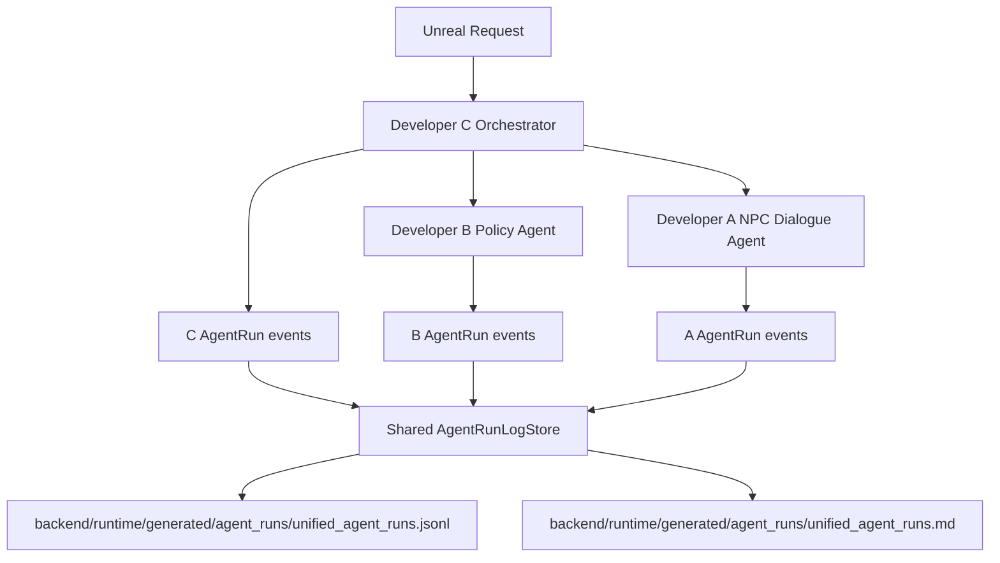

# Unified AgentRun Log Implementation Plan

> **For agentic workers:** REQUIRED SUB-SKILL: Use superpowers:executing-plans to implement this plan task-by-task. Steps use checkbox (`- [ ]`) syntax for tracking.

**Goal:** Developer A/B/C Agent 실행 기록을 하나의 구조화 로그와 하나의 사람이 읽기 쉬운 Markdown 로그에 append해, 한 턴에서 어떤 agent가 어떤 순서로 시작/종료되고 어떤 tool/middleware를 호출했는지 한 곳에서 볼 수 있게 만든다.

**Architecture:** 각 agent의 tool/middleware 소유권은 유지한다. 공용 writer는 `backend/app/services/shared/agent_run_log_store.py`에 두고, A/B/C 각 내부 middleware가 동일 schema를 가진 record를 이 writer에 append한다. 1차 구현은 로컬 JSONL 파일과 Markdown 파일을 함께 저장하며, DB AgentRun 연동은 별도 계약으로 남긴다.

**Tech Stack:** Python 3.12, pathlib, json, dataclasses, typing, existing FastAPI backend, uv.

---

## 1. 핵심 결정

현재 Developer A 로그는 아래처럼 A 전용 파일에 분리되어 있다.

```text
backend/runtime/generated/agent_runs/npc_dialogue_agent_runs.jsonl
backend/runtime/generated/agent_runs/npc_dialogue_artifacts.jsonl
```

요청 방향은 A/B/C 로그를 한 파일에서 보는 것이다. 따라서 1차 통합 파일은 두 종류로 둔다.

```text
backend/runtime/generated/agent_runs/unified_agent_runs.jsonl
backend/runtime/generated/agent_runs/unified_agent_runs.md
```

- `unified_agent_runs.jsonl`: 기계 처리, 테스트, DB 이전을 위한 원본 구조화 로그
- `unified_agent_runs.md`: 사람이 콘솔/에디터에서 읽고 설명하기 좋은 정리 로그

기존 A 전용 파일은 당장 삭제하지 않는다. 전환 안정성을 위해 1차 구현에서는 아래처럼 병행 저장한다.

```text
Developer A:
  기존 npc_dialogue_agent_runs.jsonl 유지
  신규 unified_agent_runs.jsonl에도 같은 실행 record append

Developer B:
  unified_agent_runs.jsonl에 append

Developer C:
  unified_agent_runs.jsonl에 append
```

추후 합의 후 A 전용 파일을 제거하거나 artifact 전용 파일만 유지한다.

## 2. 소유권 원칙

공용 writer만 shared 영역으로 둔다.

```text
backend/app/services/shared/agent_run_log_store.py
```

각 agent의 실행 event 조립은 각 agent 소유 middleware/service 안에서 한다.

```text
Developer A:
  backend/app/middleware/middleware_a/
  backend/app/services/service_a/

Developer B:
  backend/app/middleware/middleware_b/
  backend/app/services/service_b/

Developer C:
  backend/app/middleware/middleware_c/
  backend/app/services/service_c/
```

FastAPI 전역 middleware는 추가하지 않는다.

## 3. Unified AgentRun Schema

모든 agent가 한 줄에 하나의 실행 record를 append한다.

```json
{
  "schema_version": "unified_agent_run.v1",
  "agent_run_id": "npcdlg_run_abc123",
  "agent_name": "npc_dialogue_agent",
  "owner": "developer_a",
  "request_id": "req_real_wav_001",
  "session_id": "session_real_wav_001",
  "turn_index": 1,
  "status": "completed",
  "started_at": "2026-06-04T00:00:00Z",
  "completed_at": "2026-06-04T00:00:03Z",
  "source_window": {
    "source_type": "level_design_json",
    "node_id": "IMM_002_PURPOSE",
    "chapter_id": "CH0_IMMIGRATION"
  },
  "model": {
    "model_name": "gpt-4o-mini",
    "input_tokens": 812,
    "output_tokens": 96,
    "total_tokens": 908,
    "estimated_cost_usd": 0.00014
  },
  "events": [
    {
      "event": "agent_start",
      "status": "started",
      "recorded_at": "2026-06-04T00:00:00Z",
      "data_loaded": {
        "payload_keys": ["node_id", "player_text"]
      }
    },
    {
      "event": "tool_call",
      "status": "completed",
      "tool_name": "tts_service.build_kokoro_provider_request",
      "recorded_at": "2026-06-04T00:00:01Z",
      "output_summary": {
        "voice": "am_michael",
        "sample_rate": 24000
      }
    },
    {
      "event": "agent_end",
      "status": "completed",
      "recorded_at": "2026-06-04T00:00:03Z"
    }
  ],
  "summary": {
    "input": "Player answered: I will stay five days.",
    "output": "Okay. Please continue.",
    "fallback_used": true
  },
  "metadata": {
    "permission_level": "runtime_user_session",
    "cache_key": "sha256:...",
    "artifact_path": "backend/runtime/generated/agent_runs/npc_dialogue_artifacts.jsonl"
  }
}
```

## 4. Mermaid 구조



## 4.1 Human-Readable Markdown Format

`unified_agent_runs.md`는 아래 형식으로 append한다.

```markdown
## Agent Run: npc_dialogue_agent / developer_a

- Run ID: `npcdlg_run_abc123`
- Request ID: `req_real_wav_001`
- Session ID: `session_real_wav_001`
- Turn: `1`
- Status: `completed`
- Started: `2026-06-04T00:00:00Z`
- Completed: `2026-06-04T00:00:03Z`
- Model: `gpt-4o-mini`
- Tokens: `908`
- Estimated Cost USD: `0.00014`

### Source

- Source Type: `level_design_json`
- Chapter: `CH0_IMMIGRATION`
- Node: `IMM_002_PURPOSE`
- Input Summary: Player answered: I will stay five days.

### Timeline

| # | Event | Status | Tool | Data Loaded | Output |
|---|---|---|---|---|---|
| 1 | agent_start | started | - | payload keys: node_id, player_text | - |
| 2 | tool_call | completed | developer_a_input_service.normalize_level_design_payload | node_id=IMM_002_PURPOSE | candidate_text_available=false |
| 3 | tool_call | completed | tts_service.build_kokoro_provider_request | voice=am_michael | sample_rate=24000 |
| 4 | agent_end | completed | - | - | audio_url=/runtime/audio/...wav |

### Output

- Output Summary: Okay. Please continue.
- Fallback Used: `true`
- Audio URL: `/runtime/audio/kokoro/example.wav`
```

표 안에 너무 긴 JSON을 그대로 넣지 않는다. 각 event의 `data_loaded`, `input_summary`, `output_summary`는 한 줄 요약으로 압축한다. 원본 전체 JSON은 `unified_agent_runs.jsonl`에서 확인한다.

## 5. 생성/수정 파일

```text
Create:
  backend/app/services/shared/__init__.py
  backend/app/services/shared/agent_run_log_store.py
  backend/app/services/shared/agent_run_markdown_formatter.py
  backend/app/middleware/middleware_b/__init__.py
  backend/app/middleware/middleware_b/developer_b_agent_run_middleware.py
  backend/app/middleware/middleware_c/__init__.py
  backend/app/middleware/middleware_c/developer_c_agent_run_middleware.py
  backend/tests/test_unified_agent_run_log.py

Modify:
  backend/app/services/service_a/npc_dialogue_agent_run_store.py
  backend/app/services/service_a/voice_output_service.py
  backend/app/services/service_b/feedback_hint_generator.py 또는 Developer B entrypoint
  backend/app/services/service_c/orchestrator.py
  AGENTS.md
  docs/contracts/change_requests.md
  docs/implementation_logs/developer_a_implementation_log_kimyonghee.md
```

Developer B/C 실제 entrypoint는 구현 시점에 다시 확인한다. 현재 계획상 B는 policy engine entrypoint, C는 orchestrator가 가장 적합하다.

## 6. Task 1: Shared AgentRunLogStore 추가

**Files:**
- Create: `backend/app/services/shared/__init__.py`
- Create: `backend/app/services/shared/agent_run_log_store.py`
- Test: `backend/tests/test_unified_agent_run_log.py`

- [ ] **Step 1: 실패 테스트 작성**

```python
import json

from backend.app.services.shared.agent_run_log_store import AgentRunLogStore


def test_agent_run_log_store_appends_unified_record(tmp_path) -> None:
    store = AgentRunLogStore(root=tmp_path)
    record = {
        "schema_version": "unified_agent_run.v1",
        "agent_run_id": "run_1",
        "agent_name": "npc_dialogue_agent",
        "owner": "developer_a",
        "status": "completed",
        "events": [],
    }

    path = store.append(record)

    assert path == tmp_path / "unified_agent_runs.jsonl"
    assert json.loads(path.read_text(encoding="utf-8").splitlines()[0]) == record
```

- [ ] **Step 2: 구현**

```python
import json
from pathlib import Path
from typing import Any


class AgentRunLogStore:
    """A/B/C agent 실행 기록을 JSONL과 Markdown 파일에 append하는 공용 저장소."""

    def __init__(self, root: Path) -> None:
        self.root = root

    def append(self, record: dict[str, Any]) -> Path:
        path = self.root / "unified_agent_runs.jsonl"
        path.parent.mkdir(parents=True, exist_ok=True)
        with path.open("a", encoding="utf-8") as file:
            file.write(json.dumps(record, ensure_ascii=False) + "\n")
        return path

    def append_markdown(self, markdown: str) -> Path:
        path = self.root / "unified_agent_runs.md"
        path.parent.mkdir(parents=True, exist_ok=True)
        with path.open("a", encoding="utf-8") as file:
            file.write(markdown.rstrip() + "\n\n")
        return path
```

## 7. Task 2: Human-Readable Markdown Formatter 추가

**Files:**
- Create: `backend/app/services/shared/agent_run_markdown_formatter.py`
- Test: `backend/tests/test_unified_agent_run_log.py`

- [ ] **Step 1: 실패 테스트 작성**

```python
from backend.app.services.shared.agent_run_markdown_formatter import format_agent_run_markdown


def test_format_agent_run_markdown_makes_human_readable_timeline() -> None:
    record = {
        "agent_run_id": "run_1",
        "agent_name": "npc_dialogue_agent",
        "owner": "developer_a",
        "request_id": "req_1",
        "session_id": "session_1",
        "turn_index": 1,
        "status": "completed",
        "started_at": "2026-06-04T00:00:00Z",
        "completed_at": "2026-06-04T00:00:01Z",
        "source_window": {"source_type": "level_design_json", "node_id": "IMM_002_PURPOSE"},
        "model": {"model_name": "rule_based", "total_tokens": 0, "estimated_cost_usd": 0.0},
        "events": [
            {
                "event": "agent_start",
                "status": "started",
                "tool_name": None,
                "data_loaded": {"payload_keys": ["node_id", "player_text"]},
            },
            {
                "event": "tool_call",
                "status": "completed",
                "tool_name": "tts_service.build_kokoro_provider_request",
                "output_summary": {"voice": "am_michael", "sample_rate": 24000},
            },
        ],
        "summary": {"input": "Player answered: I will stay five days.", "output": "Okay. Please continue.", "fallback_used": True},
    }

    markdown = format_agent_run_markdown(record)

    assert "## Agent Run: npc_dialogue_agent / developer_a" in markdown
    assert "| 1 | agent_start | started | -" in markdown
    assert "tts_service.build_kokoro_provider_request" in markdown
    assert "- Fallback Used: `True`" in markdown
```

- [ ] **Step 2: 구현**

```python
from typing import Any


def format_agent_run_markdown(record: dict[str, Any]) -> str:
    events = record.get("events", [])
    rows = []
    for index, event in enumerate(events, start=1):
        rows.append(
            "| {index} | {event} | {status} | {tool} | {data_loaded} | {output} |".format(
                index=index,
                event=_cell(event.get("event")),
                status=_cell(event.get("status")),
                tool=_cell(event.get("tool_name") or "-"),
                data_loaded=_cell(_summarize(event.get("data_loaded") or event.get("input_summary"))),
                output=_cell(_summarize(event.get("output_summary") or event.get("error"))),
            )
        )

    model = record.get("model", {})
    source = record.get("source_window", {})
    summary = record.get("summary", {})
    return "\n".join(
        [
            f"## Agent Run: {record.get('agent_name')} / {record.get('owner')}",
            "",
            f"- Run ID: `{record.get('agent_run_id')}`",
            f"- Request ID: `{record.get('request_id')}`",
            f"- Session ID: `{record.get('session_id')}`",
            f"- Turn: `{record.get('turn_index')}`",
            f"- Status: `{record.get('status')}`",
            f"- Started: `{record.get('started_at')}`",
            f"- Completed: `{record.get('completed_at')}`",
            f"- Model: `{model.get('model_name')}`",
            f"- Tokens: `{model.get('total_tokens')}`",
            f"- Estimated Cost USD: `{model.get('estimated_cost_usd')}`",
            "",
            "### Source",
            "",
            f"- Source Type: `{source.get('source_type')}`",
            f"- Chapter: `{source.get('chapter_id')}`",
            f"- Node: `{source.get('node_id')}`",
            f"- Input Summary: {summary.get('input')}",
            "",
            "### Timeline",
            "",
            "| # | Event | Status | Tool | Data Loaded | Output |",
            "|---|---|---|---|---|---|",
            *rows,
            "",
            "### Output",
            "",
            f"- Output Summary: {summary.get('output')}",
            f"- Fallback Used: `{summary.get('fallback_used')}`",
            f"- Audio URL: `{summary.get('audio_url')}`",
        ]
    )


def _summarize(value: Any) -> str:
    if value is None:
        return "-"
    if isinstance(value, dict):
        return ", ".join(f"{key}={_short(item)}" for key, item in value.items())
    return _short(value)


def _short(value: Any) -> str:
    text = str(value)
    return text if len(text) <= 120 else text[:117] + "..."


def _cell(value: Any) -> str:
    return str(value).replace("|", "/").replace("\n", " ")
```

## 8. Task 3: Unified Record Builder 추가

**Files:**
- Create 또는 Modify: `backend/app/services/shared/agent_run_log_store.py`
- Test: `backend/tests/test_unified_agent_run_log.py`

- [ ] **Step 1: 실패 테스트 작성**

```python
from backend.app.services.shared.agent_run_log_store import build_unified_agent_run_record


def test_build_unified_agent_run_record_normalizes_model_and_events() -> None:
    record = build_unified_agent_run_record(
        agent_run_id="run_1",
        agent_name="npc_dialogue_agent",
        owner="developer_a",
        request_id="req_1",
        session_id="session_1",
        turn_index=1,
        status="completed",
        source_window={"node_id": "IMM_002_PURPOSE"},
        model_name="gpt-4o-mini",
        input_tokens=10,
        output_tokens=5,
        estimated_cost_usd=0.00001,
        events=[{"event": "agent_start", "status": "started"}],
        summary={"input": "hello", "output": "world"},
        metadata={"cache_key": "sha256:test"},
        started_at="2026-06-04T00:00:00Z",
        completed_at="2026-06-04T00:00:01Z",
    )

    assert record["schema_version"] == "unified_agent_run.v1"
    assert record["model"]["total_tokens"] == 15
    assert record["events"][0]["event"] == "agent_start"
```

- [ ] **Step 2: 구현**

```python
from typing import Any, Literal

AgentOwner = Literal["developer_a", "developer_b", "developer_c"]


def build_unified_agent_run_record(
    *,
    agent_run_id: str,
    agent_name: str,
    owner: AgentOwner,
    request_id: str | None,
    session_id: str | None,
    turn_index: int | None,
    status: str,
    source_window: dict[str, Any],
    model_name: str | None,
    input_tokens: int,
    output_tokens: int,
    estimated_cost_usd: float,
    events: list[dict[str, Any]],
    summary: dict[str, Any],
    metadata: dict[str, Any],
    started_at: str | None,
    completed_at: str | None,
) -> dict[str, Any]:
    return {
        "schema_version": "unified_agent_run.v1",
        "agent_run_id": agent_run_id,
        "agent_name": agent_name,
        "owner": owner,
        "request_id": request_id,
        "session_id": session_id,
        "turn_index": turn_index,
        "status": status,
        "started_at": started_at,
        "completed_at": completed_at,
        "source_window": source_window,
        "model": {
            "model_name": model_name,
            "input_tokens": input_tokens,
            "output_tokens": output_tokens,
            "total_tokens": input_tokens + output_tokens,
            "estimated_cost_usd": estimated_cost_usd,
        },
        "events": events,
        "summary": summary,
        "metadata": metadata,
    }
```

## 9. Task 4: Developer A AgentRun을 unified log와 readable log에 저장

**Files:**
- Modify: `backend/app/services/service_a/npc_dialogue_agent_run_store.py`
- Modify: `backend/app/services/service_a/voice_output_service.py`
- Test: `backend/tests/test_unified_agent_run_log.py`

- [ ] **Step 1: 실패 테스트 작성**

```python
import json

from backend.app.services.service_a.voice_output_service import build_voice_output_from_level_design


def test_developer_a_voice_output_appends_unified_agent_run(tmp_path) -> None:
    payload = {
        "request_id": "req_1",
        "session_id": "session_1",
        "turn_index": 1,
        "chapter_id": "CH0_IMMIGRATION",
        "node_id": "IMM_002_PURPOSE",
        "player_text": "I'm here for tourism.",
        "in_game_feedback": {
            "npc_recast_line_candidate": "You're here for tourism. How long will you stay?"
        },
        "level_hint": {
            "english_level": "beginner",
            "needs_hint": False,
            "recommended_expression": "I'm here for tourism."
        },
        "evaluation_summary": {
            "task_success": 3,
            "clarity": 3,
            "feedback_note": "Required intent and slot were understood."
        },
        "branch": {
            "branch_type": "success",
            "next_node_id": "IMM_003_DURATION"
        },
        "dialogue_directive": {
            "target_slot": "visit_purpose",
            "tone_hint": "neutral",
            "do_not_generate_npc_text": False
        },
    }

    output = build_voice_output_from_level_design(
        payload,
        runtime_root=tmp_path / "runtime",
        agent_run_root=tmp_path / "agent_runs",
        use_real_tts=False,
        use_llm_dialogue=False,
    )

    unified_path = tmp_path / "agent_runs" / "unified_agent_runs.jsonl"
    unified = json.loads(unified_path.read_text(encoding="utf-8").splitlines()[0])
    markdown = (tmp_path / "agent_runs" / "unified_agent_runs.md").read_text(encoding="utf-8")

    assert unified["agent_run_id"] == output["agent_run_id"]
    assert unified["owner"] == "developer_a"
    assert unified["agent_name"] == "npc_dialogue_agent"
    assert unified["events"][0]["event"] == "agent_start"
    assert "## Agent Run: npc_dialogue_agent / developer_a" in markdown
    assert "### Timeline" in markdown
```

- [ ] **Step 2: `NPCDialogueAgentRunStore`에 unified append 추가**

```python
from backend.app.services.shared.agent_run_log_store import (
    AgentRunLogStore,
    build_unified_agent_run_record,
)


def append_unified_agent_run(
    self,
    run: dict[str, Any],
    *,
    request_id: str | None,
    session_id: str | None,
    turn_index: int | None,
    summary: dict[str, Any],
    artifact_path: Path | None,
) -> Path:
    metadata = dict(run.get("metadata", {}))
    events = list(metadata.pop("events", []))
    record = build_unified_agent_run_record(
        agent_run_id=str(run["agent_run_id"]),
        agent_name=str(run["agent_name"]),
        owner="developer_a",
        request_id=request_id,
        session_id=session_id,
        turn_index=turn_index,
        status=str(run["status"]),
        source_window=dict(run.get("source_window", {})),
        model_name=str(run.get("model_name", "")),
        input_tokens=int(run.get("input_tokens", 0)),
        output_tokens=int(run.get("output_tokens", 0)),
        estimated_cost_usd=float(run.get("estimated_cost_usd", 0.0)),
        events=events,
        summary=summary,
        metadata={**metadata, "artifact_path": str(artifact_path) if artifact_path else None},
        started_at=run.get("created_at"),
        completed_at=run.get("completed_at"),
    )
    store = AgentRunLogStore(self.root)
    store.append_markdown(format_agent_run_markdown(record))
    return store.append(record)
```

- [ ] **Step 3: `voice_output_service`에서 unified/readable 저장 호출**

`_record_agent_run()`이 `request_id`, `session_id`, `turn_index`를 읽을 수 있도록 payload 또는 함수 인자로 넘긴다. 기존 A 전용 append 후 unified append를 호출한다.

```python
agent_run_path = store.append_agent_run(agent_run)
artifact_path = store.append_artifact(artifact)
unified_path = store.append_unified_agent_run(
    agent_run,
    request_id=_optional_str(payload.get("request_id")),
    session_id=_optional_str(payload.get("session_id")),
    turn_index=_optional_int(payload.get("turn_index")),
    summary={
        "input": payload.get("player_text"),
        "output": dialogue.get("npc_text") or dialogue.get("text"),
        "fallback_used": evidence_metadata.get("fallback", {}).get("used"),
    },
    artifact_path=artifact_path,
)
```

반환 dict에 `unified_agent_run_path`를 추가한다.
반환 dict에 `readable_agent_run_path`도 추가한다.

## 10. Task 5: Developer A adapter가 request/session/turn context를 payload에 전달

**Files:**
- Modify: `backend/app/integrations/dev_a_npc_dialogue_client.py`
- Test: existing `backend/tests/test_preprototype_flow.py` 또는 `backend/tests/test_unified_agent_run_log.py`

- [ ] **Step 1: payload에 request context 추가**

`DevANpcDialogueClient._build_level_design_payload()` 반환값에 추가한다.

```python
"request_id": payload.request_id,
"session_id": payload.session_id,
"chapter_id": payload.node_context.chapter_id,
"turn_index": None,
```

현재 `DevADialogueInput`에는 `turn_index`가 없다. 필요하면 C schema 변경이 필요하므로 1차는 `None`으로 둔다.

- [ ] **Step 2: turn_index Change Request 작성**

Developer C schema `DevADialogueInput`에 `turn_index`가 필요하면 `docs/contracts/change_requests.md`에 요청한다.

## 11. Task 6: Developer B unified/readable log 연결 계획

**Files:**
- Create: `backend/app/middleware/middleware_b/developer_b_agent_run_middleware.py`
- Modify: Developer B entrypoint after inspection.
- Test: `backend/tests/test_unified_agent_run_log.py`

- [ ] **Step 1: B middleware skeleton 작성**

```python
from datetime import UTC, datetime
from hashlib import sha256
from typing import Any


class DeveloperBAgentRunMiddleware:
    def build_record(
        self,
        *,
        request_id: str | None,
        session_id: str | None,
        turn_index: int | None,
        status: str,
        source_window: dict[str, Any],
        events: list[dict[str, Any]],
        summary: dict[str, Any],
        metadata: dict[str, Any],
    ) -> dict[str, Any]:
        now = datetime.now(UTC).isoformat()
        seed = f"developer_b:{request_id}:{session_id}:{turn_index}:{now}".encode("utf-8")
        return build_unified_agent_run_record(
            agent_run_id=f"devb_run_{sha256(seed).hexdigest()[:12]}",
            agent_name="english_level_hint_agent",
            owner="developer_b",
            request_id=request_id,
            session_id=session_id,
            turn_index=turn_index,
            status=status,
            source_window=source_window,
            model_name=str(metadata.get("model_name", "rule_based")),
            input_tokens=int(metadata.get("input_tokens", 0)),
            output_tokens=int(metadata.get("output_tokens", 0)),
            estimated_cost_usd=float(metadata.get("estimated_cost_usd", 0.0)),
            events=events,
            summary=summary,
            metadata=metadata,
            started_at=now,
            completed_at=now,
        )
```

- [ ] **Step 2: B entrypoint 연결은 Developer B 소유 확인 후 진행**

Developer B implementation files are B-owned. Developer A should not modify them unless user explicitly approves cross-owner edits. If not approved, add Change Request.

## 12. Task 7: Developer C unified/readable log 연결 계획

**Files:**
- Create: `backend/app/middleware/middleware_c/developer_c_agent_run_middleware.py`
- Modify: `backend/app/services/service_c/orchestrator.py`
- Test: `backend/tests/test_unified_agent_run_log.py`

- [ ] **Step 1: C middleware skeleton 작성**

Developer C는 전체 orchestration run을 기록한다.

Events:

```text
agent_start
tool_call: stt_service.transcribe_wav
tool_call: openkb_service.get_node_context
tool_call: understanding_agent.analyze_player_text
tool_call: dev_b_client.evaluate_turn
tool_call: dev_a_client.generate_dialogue
tool_call: response_builder.build_unreal_response
agent_end
```

- [ ] **Step 2: C entrypoint 연결은 Developer C 소유 확인 후 진행**

`orchestrator.py`는 Developer C owned. Developer A가 직접 수정하려면 명시 승인 또는 Change Request가 필요하다.

## 13. Task 8: Contract 문서 반영

**Files:**
- Modify: `docs/contracts/change_requests.md`
- Modify: `AGENTS.md`

- [ ] **Step 1: Change Request 작성**

```markdown
## Change Request - Unified AgentRun JSONL Contract

- Requester: Developer A
- Need: Developer A/B/C logs should append to one structured file for demo/debug.
- Proposed path:
  - `backend/runtime/generated/agent_runs/unified_agent_runs.jsonl`
  - `backend/runtime/generated/agent_runs/unified_agent_runs.md`
- Proposed schema:
  - `schema_version`
  - `agent_run_id`
  - `agent_name`
  - `owner`
  - `request_id`
  - `session_id`
  - `turn_index`
  - `status`
  - `started_at`
  - `completed_at`
  - `source_window`
  - `model`
  - `events`
  - `summary`
  - `metadata`
- Ownership:
  - Each developer builds events inside their own middleware.
  - Shared writer only appends validated dict records.
- Needed approval:
  - Developer B/C approval to modify their entrypoints.
```

- [ ] **Step 2: AGENTS.md 반영**

Shared Editing Rule에 추가:

```markdown
- Unified AgentRun logs are appended to `backend/runtime/generated/agent_runs/unified_agent_runs.jsonl`.
- Each developer owns the event construction for their own agent.
- The shared writer may only append records and must not inspect or mutate another developer's business logic.
```

## 14. Task 9: 검증

**Files:**
- No code changes.

- [ ] **Step 1: targeted tests**

```powershell
$env:UV_CACHE_DIR='C:\5th_project\pj05_Murphy\.tmp\uv-cache'; uv run pytest backend/tests/test_unified_agent_run_log.py -q
```

Expected:

```text
all tests passed
```

- [ ] **Step 2: full tests**

```powershell
$env:UV_CACHE_DIR='C:\5th_project\pj05_Murphy\.tmp\uv-cache'; uv run pytest -q
```

Expected:

```text
all tests passed
```

- [ ] **Step 3: ruff/mypy**

```powershell
$env:UV_CACHE_DIR='C:\5th_project\pj05_Murphy\.tmp\uv-cache'; uv run ruff check .
$env:UV_CACHE_DIR='C:\5th_project\pj05_Murphy\.tmp\uv-cache'; uv run mypy .
```

Expected:

```text
All checks passed
Success: no issues found
```

## 15. 리스크

- A/B/C 모두 한 파일에 append하면 동시 요청에서 line interleaving 위험이 있다. Python 단일 process append는 보통 atomic에 가깝지만, multi-process 운영에서는 file lock 또는 DB 전환이 필요하다.
- Developer B/C entrypoint는 각 소유자 영역이다. 사용자 명시 승인 없이 Developer A가 직접 수정하면 AGENTS.md 원칙과 충돌한다.
- unified log에 원문 전체를 저장하면 privacy/debug noise 문제가 있다. summary와 source reference 중심으로 제한한다.
- Markdown readable log는 사람이 보기 좋게 압축한 정보이므로 원본 추적은 JSONL을 기준으로 한다.
- 기존 A 전용 로그와 unified 로그가 중복 저장된다. 1차 안정화 후 중복 제거 정책을 정한다.

## 16. 실행 권장안

1차 구현:

```text
Shared writer + Developer A unified append + Change Request
```

2차 구현:

```text
Developer B/C 승인 후 각 entrypoint에 unified append 연결
```

이 순서가 안전하다. 지금 바로 B/C 파일까지 수정하려면 사용자에게 cross-owner edit 승인을 받아야 한다.
